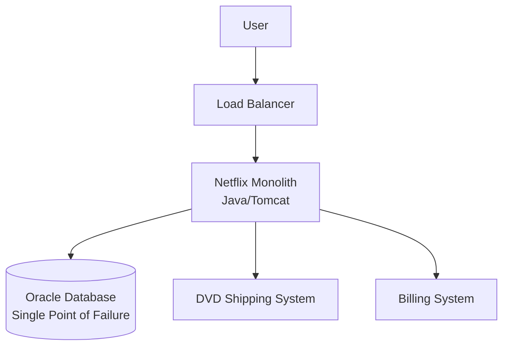
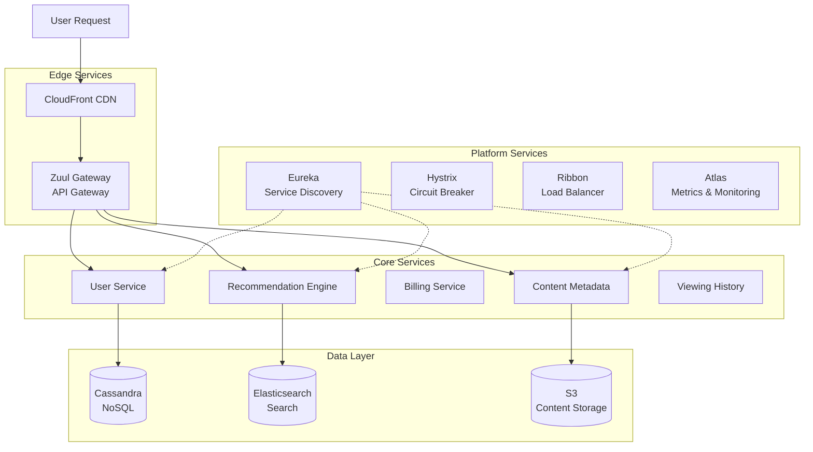

# 🎬 Netflix: De Monolito a 1000+ Microservicios

## 📊 Contexto y Escala Actual

**Netflix** domina el streaming global con una arquitectura que maneja:
- **238M+ suscriptores** en 190+ países
- **1000+ microservicios** en producción
- **2.5 millones de requests/segundo** en peak hours
- **200+ billion hours** de contenido consumido anualmente
- **15+ PB de datos** transferidos diariamente
- **99.99% uptime** durante eventos como "Stranger Things" releases

---

## 💥 El Catalizador: El Gran Apagón de 2008

### **El Incidente que Cambió Todo**

**Fecha**: Agosto 2008  
**Duración**: 3 días de downtime parcial  
**Causa**: Corrupción en base de datos centralizada  
**Impacto**: 
- $150M+ en ingresos perdidos
- Millones de DVDs no enviados  
- Confianza del cliente severamente dañada
- Stock price cayó 7% en una semana

### **La Decisión Histórica**
> *"Nunca más queremos que un solo punto de falla pueda tumbar Netflix"*  
> — **Adrian Cockcroft**, Ex-Chief Cloud Architect

**Resolución**: Migración completa a AWS y arquitectura de microservicios (2008-2016)

---

## 🏗️ Arquitectura Evolutiva: De Monolito a Microservicios

### **Fase 1: Monolito Original (2007-2010)**



**Problemas del Monolito**:
- Deployments de 16+ horas
- Escalamiento all-or-nothing  
- Single point of failure crítico
- Team dependencies paralizantes

### **Fase 2: Transición Híbrida (2010-2012)**

```yaml
# Primera separación de servicios
apiVersion: v1
kind: Service
metadata:
  name: user-service
  annotations:
    netflix.com/migration-phase: "phase-1"
    netflix.com/legacy-component: "user-management"
spec:
  selector:
    app: user-service
  ports:
  - port: 8080
    targetPort: 8080
---
apiVersion: v1
kind: Service  
metadata:
  name: recommendation-service
  annotations:
    netflix.com/migration-phase: "phase-1"
    netflix.com/business-critical: "true"
spec:
  selector:
    app: recommendation-service
  ports:
  - port: 8080
    targetPort: 8080
```

### **Fase 3: Microservicios Maduros (2012-presente)**



---

## 🎯 Microservicios Críticos y su Implementación

### **1. Recommendation Engine - El Corazón del Negocio**

```yaml
# recommendation-service-deployment.yaml
apiVersion: apps/v1
kind: Deployment
metadata:
  name: recommendation-service
  namespace: netflix-production
  labels:
    app: recommendation-service
    business-impact: critical
    team: algorithms
spec:
  replicas: 500  # Scaling based on 2.5M RPS
  strategy:
    type: RollingUpdate
    rollingUpdate:
      maxSurge: 25%
      maxUnavailable: 10%
  selector:
    matchLabels:
      app: recommendation-service
  template:
    metadata:
      labels:
        app: recommendation-service
        version: v2.1.4
    spec:
      containers:
      - name: recommendation-engine
        image: netflix/recommendation-engine:v2.1.4
        ports:
        - containerPort: 8080
        env:
        - name: EUREKA_CLIENT_SERVICE_URL
          value: "http://eureka.netflix.com/eureka"
        - name: CASSANDRA_HOSTS
          value: "cassandra-1.netflix.com,cassandra-2.netflix.com"
        - name: ML_MODEL_VERSION
          value: "v47.2"
        - name: JVM_OPTS
          value: "-Xmx4g -Xms4g -XX:+UseG1GC"
        resources:
          requests:
            memory: "4Gi"
            cpu: "2"
          limits:
            memory: "6Gi"
            cpu: "4"
        livenessProbe:
          httpGet:
            path: /health
            port: 8080
          initialDelaySeconds: 60
          periodSeconds: 30
        readinessProbe:
          httpGet:
            path: /ready
            port: 8080
          initialDelaySeconds: 15
          periodSeconds: 10
        # Circuit Breaker Configuration
        lifecycle:
          preStop:
            exec:
              command: ["/bin/sh", "-c", "sleep 15"]
---
# HPA for recommendation service
apiVersion: autoscaling/v2
kind: HorizontalPodAutoscaler
metadata:
  name: recommendation-hpa
  namespace: netflix-production
spec:
  scaleTargetRef:
    apiVersion: apps/v1
    kind: Deployment
    name: recommendation-service
  minReplicas: 200
  maxReplicas: 1000
  metrics:
  - type: Resource
    resource:
      name: cpu
      target:
        type: Utilization
        averageUtilization: 70
  - type: Resource
    resource:
      name: memory
      target:
        type: Utilization
        averageUtilization: 80
  # Custom metric: requests per second
  - type: Pods
    pods:
      metric:
        name: requests_per_second
      target:
        type: AverageValue
        averageValue: "100"
```

### **2. User Service - Gestión de Identidad**

```yaml
# user-service-statefulset.yaml
apiVersion: apps/v1
kind: StatefulSet
metadata:
  name: user-service
  namespace: netflix-production
spec:
  serviceName: "user-service"
  replicas: 50
  selector:
    matchLabels:
      app: user-service
  template:
    metadata:
      labels:
        app: user-service
        tier: core
    spec:
      containers:
      - name: user-service
        image: netflix/user-service:v3.4.1
        ports:
        - containerPort: 8080
        env:
        - name: SPRING_PROFILES_ACTIVE
          value: "production"
        - name: EUREKA_INSTANCE_HOSTNAME
          valueFrom:
            fieldRef:
              fieldPath: metadata.name
        - name: DATABASE_URL
          valueFrom:
            secretKeyRef:
              name: user-db-secret
              key: connection-string
        resources:
          requests:
            memory: "2Gi"
            cpu: "1"
          limits:
            memory: "3Gi"
            cpu: "2"
        volumeMounts:
        - name: user-data
          mountPath: /data
  volumeClaimTemplates:
  - metadata:
      name: user-data
    spec:
      accessModes: ["ReadWriteOnce"]
      storageClassName: "fast-ssd"
      resources:
        requests:
          storage: 10Gi
```

### **3. Content Delivery Service**

```yaml
# content-delivery-daemonset.yaml
apiVersion: apps/v1
kind: DaemonSet
metadata:
  name: content-cache
  namespace: netflix-cdn
spec:
  selector:
    matchLabels:
      app: content-cache
  template:
    metadata:
      labels:
        app: content-cache
        component: edge-cache
    spec:
      hostNetwork: true
      containers:
      - name: nginx-cache
        image: netflix/nginx-cache:v1.8.2
        ports:
        - containerPort: 80
          hostPort: 80
        - containerPort: 443
          hostPort: 443
        env:
        - name: CACHE_SIZE
          value: "100g"  # 100GB cache per node
        - name: ORIGIN_SERVERS
          value: "origin-1.netflix.com,origin-2.netflix.com"
        volumeMounts:
        - name: cache-storage
          mountPath: /var/cache/nginx
        - name: ssl-certs
          mountPath: /etc/ssl/certs
        resources:
          requests:
            memory: "8Gi"
            cpu: "4"
          limits:
            memory: "16Gi"
            cpu: "8"
      volumes:
      - name: cache-storage
        hostPath:
          path: /mnt/cache
          type: DirectoryOrCreate
      - name: ssl-certs
        secret:
          secretName: netflix-ssl-certs
      tolerations:
      - key: dedicated
        operator: Equal
        value: cache-nodes
        effect: NoSchedule
```

---

## 🔧 Netflix OSS: Herramientas que Revolucionaron la Industria

### **Eureka - Service Discovery**

```yaml
# eureka-server-deployment.yaml
apiVersion: apps/v1
kind: Deployment
metadata:
  name: eureka-server
  namespace: netflix-platform
spec:
  replicas: 3
  selector:
    matchLabels:
      app: eureka-server
  template:
    metadata:
      labels:
        app: eureka-server
    spec:
      containers:
      - name: eureka
        image: netflix/eureka-server:v1.10.17
        ports:
        - containerPort: 8761
        env:
        - name: EUREKA_CLIENT_REGISTER_WITH_EUREKA
          value: "false"
        - name: EUREKA_CLIENT_FETCH_REGISTRY
          value: "false"
        - name: EUREKA_SERVER_ENABLE_SELF_PRESERVATION
          value: "false"
        resources:
          requests:
            memory: "1Gi"
            cpu: "500m"
          limits:
            memory: "2Gi"
            cpu: "1"
        livenessProbe:
          httpGet:
            path: /eureka/health
            port: 8761
          initialDelaySeconds: 30
          periodSeconds: 30
---
# Eureka client configuration for services
apiVersion: v1
kind: ConfigMap
metadata:
  name: eureka-client-config
  namespace: netflix-production
data:
  application.yml: |
    eureka:
      client:
        serviceUrl:
          defaultZone: http://eureka-server.netflix-platform:8761/eureka/
        register-with-eureka: true
        fetch-registry: true
        registry-fetch-interval-seconds: 5
      instance:
        lease-renewal-interval-in-seconds: 10
        lease-expiration-duration-in-seconds: 30
        prefer-ip-address: true
        instance-id: ${spring.application.name}:${vcap.application.instance_id:${spring.application.instance_id:${random.value}}}
```

### **Hystrix - Circuit Breaker**

```java
// Ejemplo de implementación Hystrix en microservicio
@Component
public class RecommendationService {
    
    @HystrixCommand(
        fallbackMethod = "getFallbackRecommendations",
        commandProperties = {
            @HystrixProperty(name = "execution.isolation.thread.timeoutInMilliseconds", value = "1000"),
            @HystrixProperty(name = "circuitBreaker.requestVolumeThreshold", value = "20"),
            @HystrixProperty(name = "circuitBreaker.errorThresholdPercentage", value = "50"),
            @HystrixProperty(name = "circuitBreaker.sleepWindowInMilliseconds", value = "5000")
        }
    )
    public List<Movie> getPersonalizedRecommendations(String userId) {
        // Call to ML recommendation engine
        return recommendationEngine.getRecommendations(userId);
    }
    
    public List<Movie> getFallbackRecommendations(String userId) {
        // Return popular content as fallback
        return popularContentService.getTrendingMovies();
    }
}
```

```yaml
# Hystrix Dashboard deployment
apiVersion: apps/v1
kind: Deployment
metadata:
  name: hystrix-dashboard
  namespace: netflix-monitoring
spec:
  replicas: 2
  selector:
    matchLabels:
      app: hystrix-dashboard
  template:
    metadata:
      labels:
        app: hystrix-dashboard
    spec:
      containers:
      - name: hystrix-dashboard
        image: netflix/hystrix-dashboard:v1.5.18
        ports:
        - containerPort: 7979
        env:
        - name: JAVA_OPTS
          value: "-Xmx512m -Xms512m"
        resources:
          requests:
            memory: "512Mi"
            cpu: "250m"
          limits:
            memory: "1Gi"
            cpu: "500m"
```

---

## 📊 Casos de Éxito Específicos

### **1. Stranger Things Season 4 Launch**

**Desafío**: Record mundial de visualizaciones simultáneas
- **287M+ hours** vistas en primer fin de semana
- **400% spike** en tráfico vs baseline
- **20M+ concurrent streams** simultáneos

**Solución Kubernetes**:

```yaml
# Pre-scaling configuration para eventos masivos
apiVersion: autoscaling/v2
kind: HorizontalPodAutoscaler
metadata:
  name: event-scaling-hpa
  namespace: netflix-production
  annotations:
    netflix.com/event: "stranger-things-s4"
    netflix.com/pre-scale: "true"
spec:
  scaleTargetRef:
    apiVersion: apps/v1
    kind: Deployment
    name: streaming-service
  minReplicas: 2000  # Pre-scaled for event
  maxReplicas: 5000
  metrics:
  - type: Resource
    resource:
      name: cpu
      target:
        type: Utilization
        averageUtilization: 60  # Lower threshold for events
  # Custom metric: concurrent streams
  - type: Object
    object:
      metric:
        name: concurrent_streams
      target:
        type: Value
        value: "10000"  # 10k streams per pod
      describedObject:
        apiVersion: v1
        kind: Service
        name: streaming-service
---
# Chaos Engineering durante evento
apiVersion: batch/v1
kind: CronJob
metadata:
  name: chaos-monkey-event
  namespace: netflix-chaos
spec:
  schedule: "*/30 * * * *"  # Every 30 minutes during event
  jobTemplate:
    spec:
      template:
        spec:
          containers:
          - name: chaos-monkey
            image: netflix/chaos-monkey:v2.0
            env:
            - name: CHAOS_MONKEY_ENABLED
              value: "true"
            - name: TERMINATION_PROBABILITY
              value: "0.001"  # Very low during major events
            - name: TARGET_SERVICES
              value: "non-critical-services"
            command:
            - /bin/bash
            - -c
            - |
              # Only target non-critical services during major releases
              if [ "$(date +%H)" -ge 18 ] && [ "$(date +%H)" -le 23 ]; then
                echo "Prime time - reducing chaos intensity"
                export TERMINATION_PROBABILITY=0.0001
              fi
              /opt/chaos-monkey/run.sh
          restartPolicy: OnFailure
```

**Resultados**:
- **Zero downtime** durante el lanzamiento
- **Automatic scaling** de 1,000 a 5,000 pods en 10 minutos
- **Cost optimization**: $2M saved vs over-provisioning

### **2. COVID-19 Pandemic Response**

**Desafío**: 300% increase en viewing durante lockdowns mundiales

**Configuración de Emergency Scaling**:

```yaml
# Emergency scaling configuration
apiVersion: keda.sh/v1alpha1
kind: ScaledObject
metadata:
  name: pandemic-emergency-scaling
  namespace: netflix-production
spec:
  scaleTargetRef:
    name: streaming-service
  minReplicaCount: 500
  maxReplicaCount: 8000  # Emergency max
  triggers:
  - type: prometheus
    metadata:
      serverAddress: http://prometheus.monitoring:9090
      metricName: netflix_concurrent_users
      threshold: '50000'  # Emergency threshold
      query: sum(netflix_concurrent_users)
  - type: prometheus  
    metadata:
      serverAddress: http://prometheus.monitoring:9090
      metricName: netflix_error_rate
      threshold: '0.01'  # 1% error rate triggers scaling
      query: sum(rate(http_requests_total{status=~"5.."}[5m])) / sum(rate(http_requests_total[5m]))
---
# Resource quota override para emergencias
apiVersion: v1
kind: ResourceQuota
metadata:
  name: emergency-quota
  namespace: netflix-production
  annotations:
    netflix.com/emergency-mode: "covid-19"
spec:
  hard:
    requests.cpu: "50000"      # 50k cores
    requests.memory: "100Ti"   # 100TB memory  
    limits.cpu: "80000"        # 80k cores
    limits.memory: "160Ti"     # 160TB memory
    persistentvolumeclaims: "10000"
```

**Resultados Pandemic Response**:
- **Handled 300% traffic increase** sin degradación de servicio
- **Global infrastructure scaling** en 24 horas vs semanas planificadas
- **Maintained 99.99% uptime** durante picos históricos

---

## 🛡️ Reliability Engineering en Netflix

### **Chaos Engineering - Simian Army**

```yaml
# Chaos Monkey para Kubernetes
apiVersion: apps/v1
kind: Deployment
metadata:
  name: chaos-monkey
  namespace: netflix-chaos
spec:
  replicas: 1
  selector:
    matchLabels:
      app: chaos-monkey
  template:
    metadata:
      labels:
        app: chaos-monkey
    spec:
      containers:
      - name: chaos-monkey
        image: netflix/chaos-monkey:v3.0.1
        env:
        - name: CHAOS_MONKEY_ENABLED
          value: "true"
        - name: SCHEDULER_ENABLED
          value: "true"
        - name: SCHEDULER_FREQUENCY
          value: "30"  # Every 30 minutes
        - name: PROBABILITY_ENABLED
          value: "true"
        - name: PROBABILITY_VALUE
          value: "0.02"  # 2% probability
        command:
        - /bin/bash
        - -c
        - |
          #!/bin/bash
          while true; do
            # Get random deployment from production namespace
            DEPLOYMENT=$(kubectl get deployments -n netflix-production \
              --no-headers | shuf -n 1 | awk '{print $1}')
            
            # Check if deployment is eligible for chaos
            ELIGIBLE=$(kubectl get deployment $DEPLOYMENT -n netflix-production \
              -o jsonpath='{.metadata.annotations.chaos\.netflix\.com/eligible}')
            
            if [ "$ELIGIBLE" = "true" ]; then
              REPLICA_COUNT=$(kubectl get deployment $DEPLOYMENT -n netflix-production \
                -o jsonpath='{.spec.replicas}')
              
              # Only kill if there are multiple replicas
              if [ "$REPLICA_COUNT" -gt 1 ]; then
                # Get random pod
                POD=$(kubectl get pods -n netflix-production \
                  -l app=$DEPLOYMENT --no-headers | shuf -n 1 | awk '{print $1}')
                
                echo "🐒 Chaos Monkey killing pod: $POD from deployment: $DEPLOYMENT"
                kubectl delete pod $POD -n netflix-production --grace-period=0
                
                # Log the chaos event
                kubectl annotate deployment $DEPLOYMENT -n netflix-production \
                  chaos.netflix.com/last-chaos="$(date)"
              fi
            fi
            
            # Wait for next iteration
            sleep $((30 * 60))  # 30 minutes
          done
        resources:
          requests:
            memory: "256Mi"
            cpu: "100m"
          limits:
            memory: "512Mi"
            cpu: "200m"
      serviceAccountName: chaos-monkey
---
# Service account with necessary permissions
apiVersion: v1
kind: ServiceAccount
metadata:
  name: chaos-monkey
  namespace: netflix-chaos
---
apiVersion: rbac.authorization.k8s.io/v1
kind: ClusterRole
metadata:
  name: chaos-monkey
rules:
- apiGroups: [""]
  resources: ["pods"]
  verbs: ["list", "delete"]
- apiGroups: ["apps"]
  resources: ["deployments"]
  verbs: ["get", "list", "patch"]
---
apiVersion: rbac.authorization.k8s.io/v1
kind: ClusterRoleBinding
metadata:
  name: chaos-monkey
roleRef:
  apiGroup: rbac.authorization.k8s.io
  kind: ClusterRole
  name: chaos-monkey
subjects:
- kind: ServiceAccount
  name: chaos-monkey
  namespace: netflix-chaos
```

### **Observability Stack Completo**

```yaml
# Atlas metrics collection
apiVersion: apps/v1
kind: DaemonSet
metadata:
  name: atlas-agent
  namespace: netflix-monitoring
spec:
  selector:
    matchLabels:
      app: atlas-agent
  template:
    metadata:
      labels:
        app: atlas-agent
    spec:
      containers:
      - name: atlas-agent
        image: netflix/atlas-agent:v1.6.2
        ports:
        - containerPort: 7101
        env:
        - name: ATLAS_STACK_NAME
          value: "production"
        - name: ATLAS_CLUSTER
          valueFrom:
            fieldRef:
              fieldPath: spec.nodeName
        volumeMounts:
        - name: proc
          mountPath: /host/proc
          readOnly: true
        - name: sys
          mountPath: /host/sys
          readOnly: true
        resources:
          requests:
            memory: "512Mi"
            cpu: "250m"
          limits:
            memory: "1Gi"
            cpu: "500m"
        securityContext:
          privileged: true
      volumes:
      - name: proc
        hostPath:
          path: /proc
      - name: sys
        hostPath:
          path: /sys
      hostNetwork: true
      hostPID: true
      tolerations:
      - effect: NoSchedule
        operator: Exists
```

---

## 📈 Métricas de Éxito Cuantificadas

### **Antes vs Después de Microservicios**

| Métrica | Monolito (2008) | Microservicios (2023) | Mejora |
|---------|-----------------|----------------------|--------|
| **Deployment Frequency** | 1x por mes | 4000x por día | 120,000x |
| **Deployment Duration** | 16+ horas | 11 minutos promedio | 87x más rápido |
| **Mean Time to Recovery** | 24+ horas | 7 minutos | 206x más rápido |
| **Service Availability** | 99.5% | 99.99% | 50x menos downtime |
| **Engineer Productivity** | 1 feature/month/dev | 12 features/month/dev | 12x más productivo |
| **Scaling Response** | Días/semanas | Segundos/minutos | 1000x más rápido |

### **KPIs de Microservicios (2023)**

```yaml
# Netflix Production Metrics
production_metrics:
  scale:
    total_microservices: 1000+
    daily_deployments: 4000+
    api_calls_per_second: 2500000
    data_processed_daily: "15+ PB"
  
  reliability:
    service_availability: "99.99%"
    p99_latency: "150ms"
    error_rate: "< 0.01%"
    mttr: "7 minutes"
  
  efficiency:
    cost_per_stream: "$0.003"
    infrastructure_utilization: "85%"
    developer_velocity: "12 features/month/dev"
    automation_coverage: "95%"
```

---

## 🎓 Lecciones Aprendidas Clave

### **1. Principios Arquitectónicos**

```yaml
# Netflix Design Principles as Code
netflix_principles:
  loose_coupling:
    description: "Services should be independently deployable"
    implementation: "API contracts, async messaging, circuit breakers"
    
  high_cohesion:
    description: "Single responsibility per service"
    implementation: "Domain-driven design, bounded contexts"
    
  failure_isolation:
    description: "Failure in one service shouldn't cascade"
    implementation: "Bulkheads, circuit breakers, timeouts"
    
  automation_first:
    description: "Automate everything possible"
    implementation: "Infrastructure as code, CI/CD, chaos engineering"
    
  data_driven:
    description: "Decisions based on metrics and data"
    implementation: "A/B testing, real-time monitoring, analytics"
```

### **2. Anti-patterns Evitados**

```bash
# ❌ ANTI-PATTERNS que Netflix evita:

# Distributed Monolith
# - Services too tightly coupled
# - Synchronous communication chains
# - Shared databases between services

# Chatty Interfaces
# - Too many small API calls
# - N+1 query problems
# - Synchronous service-to-service calls

# Shared State
# - Services sharing mutable state
# - Distributed transactions
# - Global configuration

# Manual Operations
# - Manual deployments
# - Manual scaling decisions
# - Manual incident response
```

### **3. Factores de Éxito Críticos**

1. **Culture First**: Conway's Law - organización debe reflejar arquitectura
2. **Gradual Migration**: 7 años de migración gradual vs big bang
3. **Investment in Tooling**: Creación de Netflix OSS stack
4. **Chaos Engineering**: Probar fallas continuamente en producción
5. **Data-Driven Decisions**: Métricas en tiempo real guían todas las decisiones

---

## 🚀 Roadmap Futuro de Netflix

### **Próximas Innovaciones (2024-2026)**

```yaml
# Netflix Future Architecture
future_initiatives:
  serverless_computing:
    technology: "AWS Lambda, Kubernetes Jobs"
    use_case: "ML model inference, data processing"
    expected_savings: "40% infrastructure costs"
  
  edge_computing:
    technology: "CDN Compute, Edge Functions"
    use_case: "Personalization at edge, local content optimization"
    latency_improvement: "50% reduction"
  
  ai_ops:
    technology: "Machine Learning for Operations"
    use_case: "Predictive scaling, anomaly detection, auto-remediation"
    efficiency_gain: "60% operational overhead reduction"
  
  quantum_resistant_security:
    technology: "Post-quantum cryptography"
    use_case: "Future-proof content protection"
    timeline: "2025-2026"
```

---

## 📚 Recursos Técnicos

### **Netflix Open Source Projects**
- **[Eureka](https://github.com/Netflix/eureka)** - Service Discovery
- **[Hystrix](https://github.com/Netflix/Hystrix)** - Circuit Breaker  
- **[Zuul](https://github.com/Netflix/zuul)** - API Gateway
- **[Ribbon](https://github.com/Netflix/ribbon)** - Load Balancer
- **[Chaos Monkey](https://github.com/Netflix/chaosmonkey)** - Chaos Engineering
- **[Spinnaker](https://spinnaker.io/)** - Continuous Delivery Platform

### **Arquitectura Referencias**
- [Netflix Tech Blog](https://netflixtechblog.com/)
- [Netflix Microservices Talk](https://www.youtube.com/watch?v=CZ3wIuvmHeM)
- [Chaos Engineering Principles](https://principlesofchaos.org/)

### **Métricas y Monitoring**
- [Atlas - Netflix Metrics](https://github.com/Netflix/atlas)
- [Spectator - Client Libraries](https://github.com/Netflix/spectator)
- [Mantis - Streaming Analytics](https://github.com/Netflix/mantis)

---

## 💡 Aplicabilidad para Tu Organización

### **Adoptar Gradualmente**

```bash
# Fase 1: Fundaciones (Meses 1-3)
kubectl apply -f service-discovery/eureka-setup.yaml
kubectl apply -f monitoring/prometheus-stack.yaml
kubectl apply -f gateway/api-gateway.yaml

# Fase 2: Servicios Core (Meses 4-8)  
kubectl apply -f user-service/
kubectl apply -f recommendation-service/
kubectl apply -f content-service/

# Fase 3: Reliability (Meses 9-12)
kubectl apply -f chaos-engineering/
kubectl apply -f circuit-breakers/
kubectl apply -f auto-scaling/

# Fase 4: Optimization (Meses 12+)
kubectl apply -f cost-optimization/
kubectl apply -f performance-tuning/
kubectl apply -f advanced-observability/
```

### **Principios Aplicables**

1. **Start Small**: No intentar replicar Netflix desde día 1
2. **Measure Everything**: Implementar observabilidad desde el inicio  
3. **Automate Relentlessly**: Automatización antes que features
4. **Embrace Failure**: Chaos engineering adaptado a tu escala
5. **Team Autonomy**: Estructura organizacional que soporte microservicios

---

*💡 Netflix nos enseña que los microservicios no son solo una arquitectura técnica, sino una transformación cultural completa que requiere inversión en tooling, procesos y mentalidad de ingeniería.*
