# 🔄 Metodologías DevOps Integradas con Kubernetes

## 🎯 Introducción

Esta sección detalla las **metodologías DevOps fundamentales** que se integran naturalmente con Kubernetes para crear un ecosistema completo de desarrollo y operaciones modernas.

Cada metodología incluye:
- 📚 **Conceptos fundamentales** y principios
- 🛠️ **Herramientas específicas** para Kubernetes
- 📋 **Implementación práctica** paso a paso
- 🎯 **Casos de uso reales** de la industria
- 🔧 **Configuraciones de ejemplo** ejecutables

---

## 📚 Metodologías Disponibles

### 🔄 [GitOps](./gitops.md)
**Declarative Operations through Git**
- Infraestructura como código versionada
- ArgoCD, Flux, y GitHub Actions
- Rollbacks automáticos y auditoría completa
- **Casos reales**: Weaveworks, Intuit, Adobe

### 🎯 [Site Reliability Engineering (SRE)](./sre.md)  
**Google's Production Engineering Philosophy**
- Service Level Objectives (SLOs) y Error Budgets
- Toil automation y incident response
- Prometheus, Grafana, y PagerDuty integration
- **Casos reales**: Google, Netflix, Spotify

### 🛡️ [DevSecOps](./devsecops.md)
**Security as Code Integration**
- Shift-left security en pipelines
- Policy as Code con OPA Gatekeeper
- Container scanning y vulnerability management
- **Casos reales**: Capital One, Target, JPMorgan

### 💰 [FinOps](./finops.md)
**Cloud Financial Operations**
- Cost optimization y resource management
- Chargeback y showback models
- Kubecost, AWS Cost Explorer integration
- **Casos reales**: Spotify, Netflix, Airbnb

### 🏗️ [Platform Engineering](./platform-engineering.md)
**Internal Developer Platforms**
- Self-service developer experiences
- Golden path templates y best practices
- Backstage, Crossplane integration
- **Casos reales**: Spotify, Netflix, Uber

---

## 🎪 Integración de Metodologías

### 🔀 **The DevOps Loop con Kubernetes**

```mermaid
graph LR
    subgraph "Plan"
        A[Requirements] --> B[Design]
        B --> C[Architecture]
    end
    
    subgraph "Code"
        C --> D[Development]
        D --> E[Testing]
        E --> F[Git Commit]
    end
    
    subgraph "Build"
        F --> G[CI Pipeline]
        G --> H[Container Build]
        H --> I[Security Scan]
    end
    
    subgraph "Test"
        I --> J[Unit Tests]
        J --> K[Integration Tests]
        K --> L[K8s Staging]
    end
    
    subgraph "Release"
        L --> M[GitOps Deploy]
        M --> N[Canary Release]
        N --> O[Production]
    end
    
    subgraph "Deploy"
        O --> P[Auto-scaling]
        P --> Q[Load Balancing]
        Q --> R[Service Mesh]
    end
    
    subgraph "Operate"
        R --> S[Monitoring]
        S --> T[Logging]
        T --> U[Alerting]
    end
    
    subgraph "Monitor"
        U --> V[SLO Tracking]
        V --> W[Error Budgets]
        W --> A
    end
```



### 🎯 **Matriz de Metodologías vs Fases DevOps**

| Fase DevOps | GitOps | SRE | DevSecOps | FinOps | Platform Eng |
|------------|--------|-----|-----------|--------|---------------|
| **Plan** | Git workflows | SLO definition | Threat modeling | Budget planning | Platform roadmap |
| **Code** | IaC templates | Reliability code | Security libs | Cost annotations | Golden paths |
| **Build** | Git triggers | Build SLIs | Security scans | Resource tagging | Template CI |
| **Test** | Preview envs | Chaos testing | Sec testing | Cost validation | Platform testing |
| **Release** | ArgoCD sync | Gradual rollout | Policy gates | Cost monitoring | Self-service |
| **Deploy** | Declarative | Canary deploy | Runtime security | Resource quotas | Automated ops |
| **Operate** | Git audit trail | Incident response | Compliance | Optimization | Developer support |
| **Monitor** | Drift detection | SLO monitoring | Security alerts | Cost dashboards | Platform metrics |

---

## 🛠️ Stack Tecnológico por Metodología

### 🔄 **GitOps Stack**
```yaml
# Core GitOps tools
GitOps Controller: ArgoCD / Flux
Git Repository: GitHub / GitLab
Manifest Generation: Helm / Kustomize
Secret Management: Sealed Secrets / External Secrets
```

### 🎯 **SRE Stack**
```yaml
# SRE toolchain
Monitoring: Prometheus + Grafana
Alerting: AlertManager + PagerDuty
Tracing: Jaeger / Zipkin
Chaos Engineering: Chaos Monkey / Litmus
```

### 🛡️ **DevSecOps Stack**
```yaml
# Security-first tools
Policy Engine: OPA Gatekeeper
Image Scanning: Trivy / Clair
Runtime Security: Falco
Secret Management: Vault / Kubernetes Secrets
```

### 💰 **FinOps Stack**
```yaml
# Cost optimization tools
Cost Monitoring: Kubecost / OpenCost
Resource Management: VPA / HPA
Cloud Cost: AWS Cost Explorer / Azure Cost
Optimization: Spot instances / Reserved capacity
```

### 🏗️ **Platform Engineering Stack**
```yaml
# Developer platform tools
Service Catalog: Backstage
Infrastructure: Crossplane / Terraform
CI/CD Templates: Tekton / GitHub Actions
Developer Portal: Port / Humanitec
```

---

## 📊 Métricas de Éxito por Metodología

### 🔄 **GitOps Metrics**
- **Deployment Frequency**: ¿Cuántas veces por día?
- **Lead Time**: Git commit → Production
- **Mean Time to Recovery**: Git revert → Fixed
- **Change Failure Rate**: % deployments problemáticos

### 🎯 **SRE Metrics**
- **Service Level Indicators (SLIs)**: Availability, Latency, Throughput
- **Service Level Objectives (SLOs)**: 99.9% uptime target
- **Error Budget**: Remaining tolerance for downtime
- **Toil Reduction**: % automation vs manual work

### 🛡️ **DevSecOps Metrics**
- **Security Scan Coverage**: % code/containers scanned
- **Vulnerability Time to Fix**: Discovery → Remediation
- **Policy Compliance**: % policies enforced
- **Security Incidents**: Number and severity

### 💰 **FinOps Metrics**
- **Cost per Service**: $ per microservice per month
- **Resource Utilization**: % CPU/Memory actually used
- **Cost Optimization**: $ saved through right-sizing
- **Budget Variance**: Planned vs actual spend

### 🏗️ **Platform Engineering Metrics**
- **Developer Productivity**: Features per developer per sprint
- **Platform Adoption**: % teams using self-service
- **Time to First Deployment**: New developer → First deploy
- **Platform Reliability**: % platform uptime

---

## 🚀 Implementación Progresiva

### **Semana 1-2: GitOps Foundation**
```bash
# Setup básico de GitOps
kubectl create namespace argocd
kubectl apply -n argocd -f https://raw.githubusercontent.com/argoproj/argo-cd/stable/manifests/install.yaml

# Primera aplicación GitOps
kubectl apply -f gitops-app-example.yaml
```

### **Semana 3-4: SRE Observability**
```bash
# Deploy Prometheus stack
helm repo add prometheus-community https://prometheus-community.github.io/helm-charts
helm install prometheus prometheus-community/kube-prometheus-stack

# Configurar SLOs
kubectl apply -f slo-definitions.yaml
```

### **Semana 5-6: DevSecOps Security**
```bash
# Install OPA Gatekeeper
kubectl apply -f https://raw.githubusercontent.com/open-policy-agent/gatekeeper/release-3.14/deploy/gatekeeper.yaml

# Security policies
kubectl apply -f security-policies.yaml
```

### **Semana 7-8: FinOps Cost Management**
```bash
# Deploy Kubecost
kubectl create namespace kubecost
helm repo add kubecost https://kubecost.github.io/cost-analyzer/
helm install kubecost kubecost/cost-analyzer --namespace kubecost
```

---

## 🎓 Casos de Uso por Industria

### 🎮 **Gaming (Epic Games)**
- **GitOps**: Game builds deployed via Git tags
- **SRE**: 99.99% uptime during Fortnite events
- **DevSecOps**: Anti-cheat security in containers
- **FinOps**: Cost optimization for global edge deployment

### 🏦 **FinTech (Capital One)**
- **GitOps**: Regulatory compliance through audit trails
- **SRE**: Mission-critical payment systems SLOs
- **DevSecOps**: PCI-DSS compliance automation
- **FinOps**: Multi-cloud cost optimization

### 🛒 **E-commerce (Shopify)**
- **GitOps**: Black Friday deployment freezes
- **SRE**: Error budgets for merchant availability
- **DevSecOps**: PII protection and GDPR compliance
- **FinOps**: Merchant-specific cost allocation

---

## 💡 Principios Transversales

### **1. Everything as Code**
```yaml
# Infrastructure as Code
apiVersion: argoproj.io/v1alpha1
kind: Application
metadata:
  name: infrastructure
spec:
  source:
    repoURL: https://github.com/company/infrastructure
    path: terraform/
    targetRevision: main
```

### **2. Observability by Default**
```yaml
# Automatic instrumentation
apiVersion: v1
kind: Pod
metadata:
  annotations:
    prometheus.io/scrape: "true"
    prometheus.io/port: "8080"
    sidecar.istio.io/inject: "true"
```

### **3. Security by Design**
```yaml
# Security policies from day 1
apiVersion: templates.gatekeeper.sh/v1beta1
kind: ConstraintTemplate
metadata:
  name: k8srequiredsecuritycontext
```

### **4. Cost Awareness**
```yaml
# Resource quotas and limits
apiVersion: v1
kind: ResourceQuota
metadata:
  name: team-quota
spec:
  hard:
    requests.cpu: "10"
    requests.memory: 20Gi
    limits.cpu: "20"
    limits.memory: 40Gi
```

---

## 🔗 Enlaces Rápidos

- [GitOps Implementation Guide](./gitops.md)
- [SRE Best Practices](./sre.md)
- [DevSecOps Automation](./devsecops.md)
- [FinOps Cost Optimization](./finops.md)
- [Platform Engineering Patterns](./platform-engineering.md)

---

*💡 La integración exitosa de estas metodologías no es opcional en el DevOps moderno - es lo que separa a las organizaciones de alta performance del resto.* 