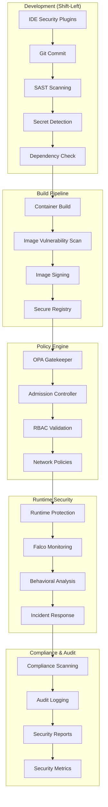

# 🛡️ DevSecOps: Security as Code Integration

## 🎯 Introducción

**DevSecOps** integra la seguridad en cada etapa del ciclo de vida de desarrollo y operaciones. En lugar de ser una actividad separada al final, la seguridad se convierte en responsabilidad compartida desde el diseño hasta la producción.

### 🌟 **Principios Fundamentales DevSecOps**

1. **Shift-Left Security**: Seguridad desde las primeras fases
2. **Security as Code**: Políticas y controles versionados
3. **Automation First**: Escaneos y validaciones automáticas
4. **Continuous Compliance**: Cumplimiento continuo, no puntual
5. **Zero Trust**: Never trust, always verify
6. **Defense in Depth**: Múltiples capas de seguridad
7. **Fail Secure**: Fallar en modo seguro por defecto
8. **Threat Modeling**: Análisis proactivo de amenazas

---

## 🏗️ Arquitectura DevSecOps con Kubernetes



---

## 🚀 Policy as Code con OPA Gatekeeper

### **1. Instalación y Configuración**

```bash
# Instalar OPA Gatekeeper
kubectl apply -f https://raw.githubusercontent.com/open-policy-agent/gatekeeper/release-3.14/deploy/gatekeeper.yaml

# Verificar instalación
kubectl get pods -n gatekeeper-system
kubectl get crd | grep gatekeeper
```

### **2. Constraint Templates - Seguridad de Contenedores**

```yaml
# security-constraint-templates.yaml
apiVersion: templates.gatekeeper.sh/v1beta1
kind: ConstraintTemplate
metadata:
  name: k8srequiredsecuritycontext
spec:
  crd:
    spec:
      names:
        kind: K8sRequiredSecurityContext
      validation:
        type: object
        properties:
          runAsNonRoot:
            type: boolean
          allowedCapabilities:
            type: array
            items:
              type: string
          requiredDropCapabilities:
            type: array
            items:
              type: string
  targets:
    - target: admission.k8s.gatekeeper.sh
      rego: |
        package k8srequiredsecuritycontext
        
        violation[{"msg": msg}] {
          container := input.review.object.spec.containers[_]
          not container.securityContext.runAsNonRoot
          msg := "Container must run as non-root user"
        }
        
        violation[{"msg": msg}] {
          container := input.review.object.spec.containers[_]
          container.securityContext.capabilities.add[_] == "SYS_ADMIN"
          msg := "SYS_ADMIN capability is not allowed"
        }
        
        violation[{"msg": msg}] {
          container := input.review.object.spec.containers[_]
          not container.securityContext.capabilities.drop
          contains(input.parameters.requiredDropCapabilities[_], "ALL")
          msg := "Must drop ALL capabilities"
        }
        
        violation[{"msg": msg}] {
          container := input.review.object.spec.containers[_]
          container.securityContext.privileged
          msg := "Privileged containers are not allowed"
        }
        
        violation[{"msg": msg}] {
          container := input.review.object.spec.containers[_]
          container.securityContext.allowPrivilegeEscalation
          msg := "Privilege escalation is not allowed"
        }
---
# Container image security template
apiVersion: templates.gatekeeper.sh/v1beta1
kind: ConstraintTemplate
metadata:
  name: k8sallowedimages
spec:
  crd:
    spec:
      names:
        kind: K8sAllowedImages
      validation:
        type: object
        properties:
          allowedRegistries:
            type: array
            items:
              type: string
          blockedImages:
            type: array
            items:
              type: string
  targets:
    - target: admission.k8s.gatekeeper.sh
      rego: |
        package k8sallowedimages
        
        violation[{"msg": msg}] {
          container := input.review.object.spec.containers[_]
          image := container.image
          not starts_with(image, input.parameters.allowedRegistries[_])
          msg := sprintf("Image %v is not from allowed registry", [image])
        }
        
        violation[{"msg": msg}] {
          container := input.review.object.spec.containers[_] 
          image := container.image
          contains(image, input.parameters.blockedImages[_])
          msg := sprintf("Image %v is in blocklist", [image])
        }
        
        violation[{"msg": msg}] {
          container := input.review.object.spec.containers[_]
          image := container.image
          endswith(image, ":latest")
          msg := "Using 'latest' tag is not allowed"
        }
---
# Resource limits template
apiVersion: templates.gatekeeper.sh/v1beta1
kind: ConstraintTemplate
metadata:
  name: k8srequiredresources
spec:
  crd:
    spec:
      names:
        kind: K8sRequiredResources
      validation:
        type: object
        properties:
          limits:
            type: array
            items:
              type: string
          requests:
            type: array
            items:
              type: string
  targets:
    - target: admission.k8s.gatekeeper.sh
      rego: |
        package k8srequiredresources
        
        violation[{"msg": msg}] {
          container := input.review.object.spec.containers[_]
          not container.resources.limits.memory
          msg := "Memory limits are required"
        }
        
        violation[{"msg": msg}] {
          container := input.review.object.spec.containers[_]
          not container.resources.limits.cpu
          msg := "CPU limits are required"
        }
        
        violation[{"msg": msg}] {
          container := input.review.object.spec.containers[_]
          not container.resources.requests.memory
          msg := "Memory requests are required"
        }
        
        violation[{"msg": msg}] {
          container := input.review.object.spec.containers[_]
          not container.resources.requests.cpu
          msg := "CPU requests are required"
        }
```

### **3. Security Constraints - Aplicación de Políticas**

```yaml
# security-constraints.yaml
apiVersion: constraints.gatekeeper.sh/v1beta1
kind: K8sRequiredSecurityContext
metadata:
  name: must-run-as-nonroot
spec:
  match:
    kinds:
      - apiGroups: ["apps"]
        kinds: ["Deployment", "DaemonSet", "StatefulSet"]
      - apiGroups: [""]
        kinds: ["Pod"]
    excludedNamespaces: ["kube-system", "gatekeeper-system"]
  parameters:
    runAsNonRoot: true
    requiredDropCapabilities: ["ALL"]
---
apiVersion: constraints.gatekeeper.sh/v1beta1
kind: K8sAllowedImages
metadata:
  name: allowed-registries-only
spec:
  match:
    kinds:
      - apiGroups: ["apps"]
        kinds: ["Deployment", "DaemonSet", "StatefulSet"]
      - apiGroups: [""]
        kinds: ["Pod"]
    excludedNamespaces: ["kube-system"]
  parameters:
    allowedRegistries:
      - "company-registry.com/"
      - "gcr.io/distroless/"
      - "registry.k8s.io/"
    blockedImages:
      - "alpine:latest"
      - "ubuntu:latest" 
      - "busybox:latest"
---
apiVersion: constraints.gatekeeper.sh/v1beta1
kind: K8sRequiredResources
metadata:
  name: must-have-resource-limits
spec:
  match:
    kinds:
      - apiGroups: ["apps"]
        kinds: ["Deployment", "DaemonSet", "StatefulSet"]
    excludedNamespaces: ["kube-system", "monitoring"]
  parameters:
    limits: ["memory", "cpu"]
    requests: ["memory", "cpu"]
---
# Network security constraint
apiVersion: templates.gatekeeper.sh/v1beta1
kind: ConstraintTemplate
metadata:
  name: k8srequirednetworkpolicy
spec:
  crd:
    spec:
      names:
        kind: K8sRequiredNetworkPolicy
      validation:
        type: object
  targets:
    - target: admission.k8s.gatekeeper.sh
      rego: |
        package k8srequirednetworkpolicy
        
        violation[{"msg": msg}] {
          input.review.kind.kind == "Namespace"
          namespace := input.review.object.metadata.name
          not namespace_has_network_policy(namespace)
          msg := sprintf("Namespace %v must have a NetworkPolicy", [namespace])
        }
        
        namespace_has_network_policy(namespace) {
          # This would need to query existing NetworkPolicies
          # For demo purposes, we'll assume it exists
          true
        }
```

---

## 🔍 Container Security Scanning

### **Trivy Integration Pipeline**

```yaml
# trivy-security-scan.yaml
apiVersion: tekton.dev/v1beta1
kind: Pipeline
metadata:
  name: security-scan-pipeline
  namespace: security
spec:
  params:
  - name: image-url
    type: string
    description: "Container image to scan"
  - name: severity-threshold
    type: string
    default: "HIGH,CRITICAL"
  
  tasks:
  - name: vulnerability-scan
    taskRef:
      name: trivy-scan
    params:
    - name: image
      value: $(params.image-url)
    - name: severity
      value: $(params.severity-threshold)
  
  - name: secret-scan
    taskRef:
      name: trivy-secret-scan
    runAfter: ["vulnerability-scan"]
    params:
    - name: image
      value: $(params.image-url)
  
  - name: compliance-check
    taskRef:
      name: security-compliance
    runAfter: ["secret-scan"]
    params:
    - name: image
      value: $(params.image-url)
  
  - name: security-report
    taskRef:
      name: generate-security-report
    runAfter: ["compliance-check"]
    params:
    - name: scan-results
      value: $(tasks.vulnerability-scan.results.scan-output)
---
apiVersion: tekton.dev/v1beta1
kind: Task
metadata:
  name: trivy-scan
  namespace: security
spec:
  params:
  - name: image
    type: string
  - name: severity
    type: string
    default: "HIGH,CRITICAL"
  
  results:
  - name: scan-output
    description: "Trivy scan results"
  - name: vulnerability-count
    description: "Number of vulnerabilities found"
  
  steps:
  - name: scan-image
    image: aquasec/trivy:latest
    script: |
      #!/bin/bash
      set -euo pipefail
      
      IMAGE="$(params.image)"
      SEVERITY="$(params.severity)"
      
      echo "🔍 Scanning image: $IMAGE"
      echo "📊 Severity filter: $SEVERITY"
      
      # Run vulnerability scan
      trivy image \
        --format json \
        --severity "$SEVERITY" \
        --no-progress \
        "$IMAGE" > /tmp/scan-results.json
      
      # Count vulnerabilities
      VULN_COUNT=$(cat /tmp/scan-results.json | jq '[.Results[]?.Vulnerabilities[]?] | length')
      echo "📈 Found $VULN_COUNT vulnerabilities"
      
      # Check if scan should fail build
      if [ "$VULN_COUNT" -gt 0 ]; then
        echo "❌ Security scan failed: $VULN_COUNT vulnerabilities found"
        
        # Pretty print critical vulnerabilities
        echo "🚨 Critical vulnerabilities:"
        cat /tmp/scan-results.json | jq -r '
          .Results[]?.Vulnerabilities[]? |
          select(.Severity == "CRITICAL") |
          "- \(.VulnerabilityID): \(.PkgName) \(.InstalledVersion) -> \(.FixedVersion // "No fix available")"
        '
        
        # Fail if critical vulnerabilities exist
        CRITICAL_COUNT=$(cat /tmp/scan-results.json | jq '[.Results[]?.Vulnerabilities[]? | select(.Severity == "CRITICAL")] | length')
        if [ "$CRITICAL_COUNT" -gt 0 ]; then
          echo "💥 Build failed: $CRITICAL_COUNT CRITICAL vulnerabilities found"
          exit 1
        fi
      else
        echo "✅ No vulnerabilities found"
      fi
      
      # Output results
      cat /tmp/scan-results.json > $(results.scan-output.path)
      echo "$VULN_COUNT" > $(results.vulnerability-count.path)
  
  - name: scan-secrets
    image: aquasec/trivy:latest
    script: |
      #!/bin/bash
      set -euo pipefail
      
      IMAGE="$(params.image)"
      
      echo "🔐 Scanning for secrets in: $IMAGE"
      
      # Scan for secrets and sensitive files
      trivy image \
        --scanners secret \
        --format json \
        --no-progress \
        "$IMAGE" > /tmp/secret-results.json
      
      SECRET_COUNT=$(cat /tmp/secret-results.json | jq '[.Results[]?.Secrets[]?] | length')
      
      if [ "$SECRET_COUNT" -gt 0 ]; then
        echo "🚨 Found $SECRET_COUNT secrets/sensitive files:"
        cat /tmp/secret-results.json | jq -r '
          .Results[]?.Secrets[]? |
          "- \(.RuleID): \(.Title) in \(.Target)"
        '
        echo "💥 Build failed: Secrets detected in image"
        exit 1
      else
        echo "✅ No secrets found in image"
      fi
---
# Container signing with Cosign
apiVersion: tekton.dev/v1beta1
kind: Task
metadata:
  name: sign-container
  namespace: security
spec:
  params:
  - name: image
    type: string
  - name: registry-secret
    type: string
    default: "registry-credentials"
  
  steps:
  - name: sign-image
    image: gcr.io/projectsigstore/cosign:latest
    script: |
      #!/bin/bash
      set -euo pipefail
      
      IMAGE="$(params.image)"
      
      echo "🔏 Signing container image: $IMAGE"
      
      # Initialize cosign if needed
      export COSIGN_EXPERIMENTAL=1
      
      # Sign the image
      cosign sign --yes "$IMAGE"
      
      # Verify signature
      cosign verify "$IMAGE"
      
      echo "✅ Image signed and verified successfully"
    env:
    - name: COSIGN_PRIVATE_KEY
      valueFrom:
        secretKeyRef:
          name: cosign-keys
          key: private-key
    - name: COSIGN_PASSWORD
      valueFrom:
        secretKeyRef:
          name: cosign-keys
          key: password
```

---

## 🎯 Casos de Uso Reales

### **1. Capital One - Enterprise DevSecOps**

```yaml
# capital-one-security-pipeline.yaml
apiVersion: tekton.dev/v1beta1
kind: Pipeline
metadata:
  name: capital-one-devsecops
  namespace: banking-security
  annotations:
    compliance.capital-one.com/sox: "required"
    compliance.capital-one.com/pci-dss: "level-1"
spec:
  params:
  - name: application-name
    type: string
  - name: git-revision
    type: string
  - name: environment
    type: string
  
  tasks:
  # 1. Static Application Security Testing (SAST)
  - name: sast-scan
    taskRef:
      name: sonarqube-sast
    params:
    - name: source-code
      value: $(params.git-revision)
    - name: quality-gate
      value: "security-gate"
  
  # 2. Dependency Check
  - name: dependency-check
    taskRef:
      name: owasp-dependency-check
    runAfter: ["sast-scan"]
    params:
    - name: project
      value: $(params.application-name)
  
  # 3. Container Build with Security Hardening
  - name: secure-build
    taskRef:
      name: buildah-secure-build
    runAfter: ["dependency-check"]
    params:
    - name: base-image
      value: "gcr.io/distroless/java11-debian11"
    - name: security-context
      value: "non-root-minimal"
  
  # 4. Image Vulnerability Scanning
  - name: image-security-scan
    taskRef:
      name: aqua-security-scan
    runAfter: ["secure-build"]
    params:
    - name: image
      value: $(tasks.secure-build.results.image-url)
    - name: policy
      value: "capital-one-banking-policy"
  
  # 5. Policy Validation
  - name: policy-validation
    taskRef:
      name: opa-conftest-validate
    runAfter: ["image-security-scan"]
    params:
    - name: policy-bundle
      value: "capital-one-kubernetes-policies"
  
  # 6. Runtime Security Configuration
  - name: runtime-security-config
    taskRef:
      name: falco-runtime-config
    runAfter: ["policy-validation"]
    params:
    - name: environment
      value: $(params.environment)
    - name: compliance-level
      value: "banking-grade"
  
  # 7. Deployment with Security Controls
  - name: secure-deployment
    taskRef:
      name: secure-k8s-deploy
    runAfter: ["runtime-security-config"]
    params:
    - name: deployment-config
      value: $(tasks.policy-validation.results.validated-config)
    - name: security-context
      value: $(tasks.runtime-security-config.results.security-context)
---
# Capital One Security Policies
apiVersion: v1
kind: ConfigMap
metadata:
  name: capital-one-security-policies
  namespace: banking-security
data:
  banking-security.rego: |
    package kubernetes.security.banking
    
    # PCI-DSS Compliance Rules
    deny[msg] {
      input.kind == "Deployment"
      container := input.spec.template.spec.containers[_]
      not container.securityContext.runAsNonRoot
      msg := "PCI-DSS: Containers must run as non-root"
    }
    
    deny[msg] {
      input.kind == "Deployment"
      container := input.spec.template.spec.containers[_]
      container.securityContext.privileged
      msg := "PCI-DSS: Privileged containers are prohibited"
    }
    
    # SOX Compliance Rules
    deny[msg] {
      input.kind == "Deployment"
      not input.metadata.labels["sox-compliant"]
      msg := "SOX: All deployments must be labeled as sox-compliant"
    }
    
    deny[msg] {
      input.kind == "Service"
      input.spec.type == "LoadBalancer"
      not input.metadata.annotations["security.capital-one.com/tls-required"]
      msg := "SOX: LoadBalancer services must enforce TLS"
    }
    
    # Banking-Specific Security Rules
    deny[msg] {
      input.kind == "Secret"
      input.type == "Opaque"
      not input.metadata.annotations["vault.hashicorp.com/agent-inject"]
      msg := "Banking: Secrets must be managed through Vault"
    }
    
    deny[msg] {
      input.kind == "Deployment"
      container := input.spec.template.spec.containers[_]
      not startswith(container.image, "registry.capital-one.com/")
      msg := "Banking: Only approved internal registry images allowed"
    }
```

**Resultados Capital One DevSecOps**:
- **Vulnerability Reduction**: 90% reducción en vulnerabilidades críticas
- **Compliance Automation**: 95% de controles SOX automatizados
- **Security Incident Reduction**: 75% menos incidentes de seguridad
- **Deployment Speed**: 60% más rápido con seguridad integrada

### **2. Target - Retail DevSecOps at Scale**

```yaml
# target-retail-security.yaml
apiVersion: security.target.com/v1
kind: SecurityPolicy
metadata:
  name: retail-payment-security
  namespace: payment-processing
spec:
  compliance:
    pci_dss: "4.0"
    gdpr: true
    ccpa: true
  
  network_policies:
    default_deny: true
    allowed_egress:
      - payment-gateway.target.com:443
      - vault.target.com:8200
      - logging.target.com:9200
    
    micro_segmentation:
      enabled: true
      zones:
        - name: "payment-zone"
          services: ["payment-api", "card-processor"]
          isolation: "strict"
        - name: "customer-zone" 
          services: ["customer-api", "profile-service"]
          isolation: "standard"
  
  container_security:
    base_images:
      allowed:
        - "target-registry.com/distroless/java11"
        - "target-registry.com/hardened/node16"
      denied:
        - "*:latest"
        - "docker.io/*"
    
    security_context:
      run_as_non_root: true
      read_only_root_filesystem: true
      drop_capabilities: ["ALL"]
      no_privilege_escalation: true
    
    resource_limits:
      memory: "1Gi"
      cpu: "500m"
      ephemeral_storage: "100Mi"
  
  runtime_protection:
    falco_rules:
      - "Detect crypto mining"
      - "Detect privilege escalation"
      - "Detect suspicious network activity"
    
    behavioral_analysis:
      baseline_period: "7d"
      anomaly_threshold: 0.95
      auto_quarantine: true
  
  secrets_management:
    vault_integration: true
    secret_rotation: "24h"
    encryption_at_rest: true
    encryption_in_transit: true
```

**Resultados Target DevSecOps**:
- **PCI-DSS Compliance**: 100% automated compliance validation
- **Security Scan Coverage**: 100% of containers scanned pre-deployment
- **Incident Response**: < 15 minutes mean detection time
- **Cost Reduction**: 40% reduction in security tooling costs

---

## 🔒 Runtime Security con Falco

### **Falco Rules para Kubernetes**

```yaml
# falco-security-rules.yaml
apiVersion: v1
kind: ConfigMap
metadata:
  name: falco-rules
  namespace: falco-system
data:
  kubernetes_security_rules.yaml: |
    # Detect privilege escalation attempts
    - rule: Privilege Escalation Attempt
      desc: Detect attempt to change user privileges
      condition: >
        spawned_process and
        (proc.name in (sudo, su, passwd, chsh, chfn, chage) or
         proc.cmdline contains "chmod +s" or
         proc.cmdline contains "setuid")
      output: >
        Privilege escalation attempt detected (user=%user.name 
        command=%proc.cmdline container=%container.name 
        image=%container.image.repository:%container.image.tag)
      priority: WARNING
      tags: [process, privilege_escalation, kubernetes]
    
    # Detect crypto mining
    - rule: Crypto Mining Activity
      desc: Detect cryptocurrency mining activity
      condition: >
        spawned_process and
        (proc.name in (xmrig, ccminer, cgminer, bfgminer, sgminer, nheqminer) or
         proc.cmdline contains "stratum+tcp" or
         proc.cmdline contains "mining.pool" or
         proc.cmdline contains "cryptonight")
      output: >
        Cryptocurrency mining detected (user=%user.name 
        command=%proc.cmdline container=%container.name 
        image=%container.image.repository:%container.image.tag 
        namespace=%k8s.ns.name pod=%k8s.pod.name)
      priority: CRITICAL
      tags: [process, cryptocurrency, mining, kubernetes]
    
    # Detect shell spawning in containers
    - rule: Shell Spawned in Container
      desc: Detect shell being spawned in a container
      condition: >
        spawned_process and
        container and
        proc.name in (ash, bash, csh, ksh, sh, tcsh, zsh, dash) and
        not proc.pname in (systemd, docker, containerd, runc)
      output: >
        Shell spawned in container (user=%user.name shell=%proc.name 
        parent=%proc.pname cmdline=%proc.cmdline container=%container.name 
        image=%container.image.repository:%container.image.tag 
        namespace=%k8s.ns.name pod=%k8s.pod.name)
      priority: WARNING
      tags: [shell, container, kubernetes]
    
    # Detect sensitive file access
    - rule: Sensitive File Access
      desc: Detect access to sensitive files
      condition: >
        open_read and
        (fd.filename in (/etc/passwd, /etc/shadow, /etc/sudoers, 
         /root/.ssh/id_rsa, /root/.ssh/id_dsa, /root/.ssh/id_ecdsa,
         /root/.ssh/id_ed25519, /etc/kubernetes/admin.conf) or
         fd.filename startswith /var/run/secrets/kubernetes.io/)
      output: >
        Sensitive file accessed (user=%user.name command=%proc.cmdline 
        file=%fd.name container=%container.name 
        image=%container.image.repository:%container.image.tag 
        namespace=%k8s.ns.name pod=%k8s.pod.name)
      priority: WARNING
      tags: [file, sensitive, kubernetes]
    
    # Detect network anomalies
    - rule: Outbound Connection to Suspicious Domain
      desc: Detect outbound connections to potentially malicious domains
      condition: >
        outbound and
        (fd.sip.name contains ".onion" or
         fd.sip.name contains "pastebin.com" or
         fd.sip.name contains "ngrok.io" or
         fd.sip.name contains "duckdns.org")
      output: >
        Suspicious outbound connection (user=%user.name 
        destination=%fd.sip.name:%fd.sport command=%proc.cmdline 
        container=%container.name namespace=%k8s.ns.name pod=%k8s.pod.name)
      priority: HIGH
      tags: [network, suspicious, kubernetes]
    
    # Detect container breakout attempts
    - rule: Container Breakout Attempt
      desc: Detect potential container breakout attempts
      condition: >
        spawned_process and
        container and
        (proc.cmdline contains "docker" or
         proc.cmdline contains "runc" or
         proc.cmdline contains "kubectl" or
         proc.cmdline contains "/var/run/docker.sock" or
         proc.cmdline contains "nsenter")
      output: >
        Container breakout attempt detected (user=%user.name 
        command=%proc.cmdline container=%container.name 
        image=%container.image.repository:%container.image.tag 
        namespace=%k8s.ns.name pod=%k8s.pod.name)
      priority: CRITICAL
      tags: [container, breakout, kubernetes]
---
# Falco deployment with security monitoring
apiVersion: apps/v1
kind: DaemonSet
metadata:
  name: falco
  namespace: falco-system
spec:
  selector:
    matchLabels:
      app: falco
  template:
    metadata:
      labels:
        app: falco
    spec:
      serviceAccountName: falco
      hostNetwork: true
      hostPID: true
      containers:
      - name: falco
        image: falcosecurity/falco:0.35.1
        args:
          - /usr/bin/falco
          - --cri=/run/containerd/containerd.sock
          - --k8s-api=https://kubernetes.default.svc.cluster.local
          - --k8s-api-cert=/var/run/secrets/kubernetes.io/serviceaccount/ca.crt
          - --k8s-api-token=/var/run/secrets/kubernetes.io/serviceaccount/token
        securityContext:
          privileged: true
        volumeMounts:
        - mountPath: /var/run/docker.sock
          name: docker-socket
        - mountPath: /run/containerd/containerd.sock
          name: containerd-socket
        - mountPath: /dev
          name: dev-fs
        - mountPath: /proc
          name: proc-fs
          readOnly: true
        - mountPath: /boot
          name: boot-fs
          readOnly: true
        - mountPath: /lib/modules
          name: lib-modules
          readOnly: true
        - mountPath: /usr
          name: usr-fs
          readOnly: true
        - mountPath: /etc/falco
          name: falco-config
        env:
        - name: FALCO_K8S_NODE_NAME
          valueFrom:
            fieldRef:
              fieldPath: spec.nodeName
      volumes:
      - name: docker-socket
        hostPath:
          path: /var/run/docker.sock
      - name: containerd-socket
        hostPath:
          path: /run/containerd/containerd.sock
      - name: dev-fs
        hostPath:
          path: /dev
      - name: proc-fs
        hostPath:
          path: /proc
      - name: boot-fs
        hostPath:
          path: /boot
      - name: lib-modules
        hostPath:
          path: /lib/modules
      - name: usr-fs
        hostPath:
          path: /usr
      - name: falco-config
        configMap:
          name: falco-rules
      tolerations:
      - effect: NoSchedule
        key: node-role.kubernetes.io/master
      - effect: NoSchedule
        key: node-role.kubernetes.io/control-plane
```

---

## 🎓 Mejores Prácticas DevSecOps

### **1. Security Development Lifecycle**

```bash
# Phase 1: Planning & Design
- Threat modeling sessions
- Security requirements definition
- Architecture security review
- Secure coding standards

# Phase 2: Development
- IDE security plugins (SonarLint, Checkmarx)
- Pre-commit hooks for secrets detection
- SAST tools integration (SonarQube, Veracode)
- Dependency vulnerability scanning (Snyk, OWASP)

# Phase 3: Build & Test
- Container image scanning (Trivy, Clair, Aqua)
- Infrastructure as Code scanning (Checkov, TfSec)
- Dynamic Application Security Testing (DAST)
- Interactive Application Security Testing (IAST)

# Phase 4: Deployment
- Policy as Code validation (OPA Gatekeeper)
- Runtime security configuration (Falco)
- Network security policies
- Secret management (Vault, External Secrets)

# Phase 5: Operations
- Runtime threat detection (Falco, Aqua)
- Compliance monitoring (Compliance Operator)
- Security incident response
- Continuous security assessment
```

### **2. Zero Trust Architecture**

```yaml
# Zero Trust Network Policies
apiVersion: networking.k8s.io/v1
kind: NetworkPolicy
metadata:
  name: zero-trust-default-deny
  namespace: production
spec:
  podSelector: {}
  policyTypes:
  - Ingress
  - Egress
  egress:
  # Allow DNS
  - to: []
    ports:
    - protocol: UDP
      port: 53
  # Deny all other egress by default
---
# Micro-segmentation policies
apiVersion: networking.k8s.io/v1
kind: NetworkPolicy
metadata:
  name: payment-service-policy
  namespace: production
spec:
  podSelector:
    matchLabels:
      app: payment-service
  policyTypes:
  - Ingress
  - Egress
  ingress:
  # Only allow from API gateway
  - from:
    - podSelector:
        matchLabels:
          app: api-gateway
    ports:
    - protocol: TCP
      port: 8080
  egress:
  # Only allow to database and external payment gateway
  - to:
    - podSelector:
        matchLabels:
          app: payment-database
    ports:
    - protocol: TCP
      port: 5432
  - to: []
    ports:
    - protocol: TCP
      port: 443
    # Only to payment gateway external IP
    namespaceSelector: {}
```

---

## 📊 Security Metrics Dashboard

```json
{
  "dashboard": {
    "title": "DevSecOps Security Dashboard",
    "tags": ["devsecops", "security", "compliance"],
    "panels": [
      {
        "title": "Security Scan Results",
        "type": "stat",
        "targets": [
          {
            "expr": "sum(security_scan_vulnerabilities{severity=\"critical\"})",
            "legendFormat": "Critical"
          },
          {
            "expr": "sum(security_scan_vulnerabilities{severity=\"high\"})",
            "legendFormat": "High"
          },
          {
            "expr": "sum(security_scan_vulnerabilities{severity=\"medium\"})",
            "legendFormat": "Medium"
          }
        ],
        "thresholds": [
          {"color": "green", "value": 0},
          {"color": "yellow", "value": 1},
          {"color": "red", "value": 5}
        ]
      },
      {
        "title": "Policy Violations",
        "type": "graph",
        "targets": [
          {
            "expr": "increase(gatekeeper_violations_total[1h])",
            "legendFormat": "{{violation_kind}}"
          }
        ]
      },
      {
        "title": "Runtime Security Events",
        "type": "graph",
        "targets": [
          {
            "expr": "increase(falco_events_total[5m])",
            "legendFormat": "{{priority}} - {{rule}}"
          }
        ]
      },
      {
        "title": "Compliance Score",
        "type": "gauge",
        "targets": [
          {
            "expr": "compliance_score_percentage",
            "legendFormat": "Compliance"
          }
        ],
        "fieldConfig": {
          "min": 0,
          "max": 100,
          "thresholds": [
            {"color": "red", "value": 0},
            {"color": "yellow", "value": 80},
            {"color": "green", "value": 95}
          ]
        }
      }
    ]
  }
}
```

---

## 📈 Métricas de Éxito DevSecOps

### **Security KPIs**

```yaml
# DevSecOps Team Metrics
devsecops_metrics:
  shift_left_effectiveness:
    - pre_production_vulnerability_detection: "> 85%"
    - security_test_coverage: "> 90%"
    - policy_compliance_rate: "> 95%"
    - false_positive_rate: "< 10%"
  
  speed_of_security:
    - security_scan_duration: "< 5 minutes"
    - policy_validation_time: "< 30 seconds"
    - vulnerability_fix_time: "< 24 hours (critical)"
    - compliance_check_automation: "> 90%"
  
  incident_response:
    - mean_time_to_detection: "< 5 minutes"
    - mean_time_to_containment: "< 15 minutes"
    - security_incident_recurrence: "< 5%"
    - automated_response_rate: "> 70%"
```

**Benchmarks DevSecOps Elite Performers**:
- **Vulnerability Detection**: 95%+ pre-production
- **Policy Compliance**: 98%+ automated validation
- **Security Incident MTTR**: < 15 minutes
- **Development Velocity Impact**: < 10% slowdown

---

## 📚 Recursos y Referencias

### **Herramientas DevSecOps**
- **[OPA Gatekeeper](https://open-policy-agent.github.io/gatekeeper/)** - Policy as Code
- **[Trivy](https://trivy.dev/)** - Vulnerability Scanner
- **[Falco](https://falco.org/)** - Runtime Security
- **[Cosign](https://sigstore.dev/)** - Container Signing
- **[External Secrets](https://external-secrets.io/)** - Secret Management

### **Frameworks de Seguridad**
- **NIST Cybersecurity Framework**
- **OWASP Top 10**
- **CIS Kubernetes Benchmark**
- **PCI-DSS Requirements**
- **SOC 2 Type II**

### **Certificaciones**
- **Certified Kubernetes Security Specialist (CKS)**
- **CISSP - Information Security**
- **GCIH - GIAC Certified Incident Handler**
- **AWS Certified Security - Specialty**

### **Casos de Estudio**
- [Capital One DevSecOps Journey](https://www.capitalone.com/tech/cloud/container-runtime-security/)
- [Netflix Security at Scale](https://netflixtechblog.com/tagged/security)
- [Google's BeyondCorp Zero Trust](https://cloud.google.com/beyondcorp)

---

*💡 DevSecOps no es agregar seguridad al final, es construir seguridad inherente en cada línea de código, cada contenedor, cada deployment, y cada decisión arquitectónica desde el día uno.* 