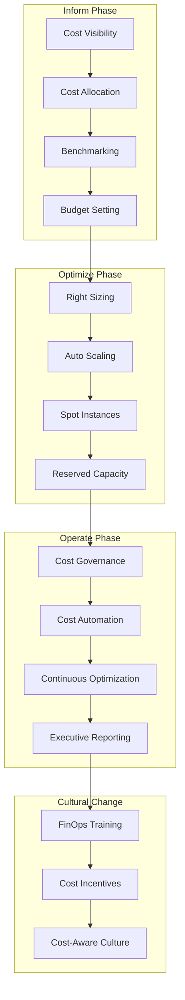

# 💰 FinOps: Financial Operations for Kubernetes

## 🎯 Introducción

**FinOps** es la disciplina que combina sistemas, mejores prácticas y cultura para aumentar la capacidad de una organización de entender los costos de la nube y tomar decisiones de negocio informadas.

### 🌟 **Principios Fundamentales FinOps**

1. **Teams Collaborate**: Colaboración entre Engineering, Finance y Business
2. **Everyone Takes Ownership**: Responsabilidad compartida de costos
3. **Centralized Team**: Equipo FinOps como facilitador
4. **FinOps Data Driven**: Decisiones basadas en datos
5. **Value Over Cost**: Optimizar valor, no solo reducir costos
6. **Speed Over Perfection**: Iteración rápida vs análisis perfecto

---

## 🏗️ FinOps Framework para Kubernetes



---

## 💡 Cost Visibility con Kubernetes

### **1. OpenCost Implementation**

```yaml
# opencost-deployment.yaml
apiVersion: apps/v1
kind: Deployment
metadata:
  name: opencost
  namespace: opencost
spec:
  replicas: 1
  selector:
    matchLabels:
      app: opencost
  template:
    metadata:
      labels:
        app: opencost
    spec:
      containers:
      - name: opencost
        image: quay.io/kubecost/kubecost-cost-model:prod-1.106.1
        ports:
        - containerPort: 9003
        env:
        - name: PROMETHEUS_SERVER_ENDPOINT
          value: "http://prometheus:9090"
        - name: CLOUD_PROVIDER_API_KEY
          valueFrom:
            secretKeyRef:
              name: cloud-provider-key
              key: api-key
        - name: CLUSTER_ID
          value: "production-cluster"
        resources:
          requests:
            memory: "256Mi"
            cpu: "100m"
          limits:
            memory: "512Mi"
            cpu: "500m"
---
# Cost allocation queries
apiVersion: v1
kind: ConfigMap
metadata:
  name: cost-queries
  namespace: opencost
data:
  allocation.promql: |
    # CPU Cost per Pod
    sum(
      rate(container_cpu_usage_seconds_total[5m]) * 
      on (node) group_left() 
      node_cpu_hourly_cost
    ) by (namespace, pod)
    
    # Memory Cost per Pod  
    sum(
      container_memory_working_set_bytes * 
      on (node) group_left()
      node_ram_hourly_cost / (1024^3)
    ) by (namespace, pod)
    
    # Storage Cost per PVC
    sum(
      kubelet_volume_stats_capacity_bytes * 
      pv_hourly_cost / (1024^3)
    ) by (namespace, persistentvolumeclaim)
```

### **2. Resource Tagging Strategy**

```yaml
# cost-allocation-labels.yaml
apiVersion: v1
kind: ConfigMap
metadata:
  name: cost-allocation-strategy
  namespace: finops
data:
  tagging-policy.yaml: |
    required_labels:
      business_unit: ["engineering", "marketing", "sales", "finance"]
      environment: ["production", "staging", "development"]
      team: ["platform", "backend", "frontend", "data"]
      cost_center: ["r&d", "infrastructure", "product"]
      project: ["project-alpha", "project-beta", "core-platform"]
    
    cost_allocation_rules:
      # Engineering teams
      - namespace_pattern: "team-*"
        allocation_method: "namespace_labels"
        chargeback: true
      
      # Shared services
      - namespace_pattern: "kube-system|monitoring|ingress"
        allocation_method: "shared_proportional"
        chargeback: false
      
      # Development environments
      - namespace_pattern: "*-dev|*-test"
        allocation_method: "development_pool"
        budget_limit: "$1000/month"
---
# Deployment with cost labels
apiVersion: apps/v1
kind: Deployment
metadata:
  name: e-commerce-api
  namespace: production
  labels:
    app: e-commerce-api
    # FinOps required labels
    business-unit: "engineering"
    team: "backend"
    cost-center: "r&d"
    project: "e-commerce-platform"
    environment: "production"
spec:
  replicas: 3
  selector:
    matchLabels:
      app: e-commerce-api
  template:
    metadata:
      labels:
        app: e-commerce-api
        business-unit: "engineering"
        team: "backend"
        cost-center: "r&d"
        project: "e-commerce-platform"
        environment: "production"
    spec:
      containers:
      - name: api
        image: e-commerce/api:v1.2.3
        resources:
          requests:
            memory: "512Mi"
            cpu: "250m"
          limits:
            memory: "1Gi"
            cpu: "500m"
```

---

## 🎯 Casos de Uso Reales

### **1. Spotify - Music Streaming FinOps**

```yaml
# spotify-finops-strategy.yaml
apiVersion: v1
kind: ConfigMap
metadata:
  name: spotify-cost-optimization
  namespace: finops
data:
  strategy.yaml: |
    # Spotify handles 400M+ users, 70M+ tracks
    # Monthly K8s spend: ~$12M across 100+ clusters
    
    workload_optimization:
      # Music streaming services
      streaming_services:
        target_cpu_utilization: 70%
        auto_scaling:
          min_replicas: 50
          max_replicas: 1000
          metrics:
            - type: Resource
              resource:
                name: cpu
                target:
                  type: Utilization
                  averageUtilization: 70
            - type: Resource
              resource:
                name: memory
                target:
                  type: Utilization
                  averageUtilization: 80
      
      # Recommendation engine (ML workloads)
      ml_workloads:
        node_affinity: "gpu-nodes"
        spot_instances: true
        schedule: "batch-processing"
        cost_limit: "$50000/month"
      
      # Content delivery
      cdn_cache:
        storage_class: "regional-ssd"
        replication: 2
        retention: "30d"
        cost_target: "80% reduction vs egress"
    
    cost_allocation:
      # By music label/content
      content_teams:
        universal_music: 25%
        sony_music: 20%
        warner_music: 15%
        independent: 40%
      
      # By feature
      feature_teams:
        streaming: 60%
        recommendations: 20%
        social: 10%
        podcasts: 10%
---
# Spotify-style HPA for cost optimization
apiVersion: autoscaling/v2
kind: HorizontalPodAutoscaler
metadata:
  name: streaming-service-hpa
  namespace: streaming
spec:
  scaleTargetRef:
    apiVersion: apps/v1
    kind: Deployment
    name: streaming-service
  minReplicas: 50
  maxReplicas: 1000
  metrics:
  - type: Resource
    resource:
      name: cpu
      target:
        type: Utilization
        averageUtilization: 70
  - type: Resource
    resource:
      name: memory
      target:
        type: Utilization
        averageUtilization: 80
  # Custom metric: cost per stream
  - type: Object
    object:
      metric:
        name: cost_per_stream
      target:
        type: Value
        value: "0.001"  # $0.001 per stream
      describedObject:
        apiVersion: v1
        kind: Service
        name: streaming-service
  behavior:
    scaleDown:
      stabilizationWindowSeconds: 300
      policies:
      - type: Percent
        value: 10
        periodSeconds: 60
    scaleUp:
      stabilizationWindowSeconds: 60
      policies:
      - type: Percent
        value: 50
        periodSeconds: 60
```

**Resultados Spotify FinOps**:
- **Cost Reduction**: 40% reducción en costos de infraestructura
- **Efficiency**: 85% CPU utilization promedio (vs 45% inicial)
- **Scaling**: Handle 100x traffic spikes with 20% cost increase
- **Visibility**: 100% cost allocation to business units

### **2. Airbnb - Travel Platform FinOps**

```yaml
# airbnb-finops-implementation.yaml
apiVersion: v1
kind: ConfigMap
metadata:
  name: airbnb-cost-strategy
  namespace: finops
data:
  optimization.yaml: |
    # Airbnb: 220+ countries, 100M+ listings
    # Seasonal traffic: 300% variance (summer vs winter)
    
    geographic_optimization:
      regions:
        us_east:
          base_cost: "$0.08/hour"
          peak_multiplier: 1.5
          spot_savings: 70%
        eu_west:
          base_cost: "$0.09/hour" 
          peak_multiplier: 1.3
          spot_savings: 65%
        asia_pacific:
          base_cost: "$0.07/hour"
          peak_multiplier: 1.8
          spot_savings: 75%
    
    workload_patterns:
      # Search & Discovery (High variance)
      search_service:
        pattern: "seasonal_peak"
        scaling_strategy: "aggressive_spot"
        cost_tolerance: "medium"
        target_utilization: 60%
      
      # Booking Engine (Critical path)
      booking_service:
        pattern: "steady_with_peaks"
        scaling_strategy: "reserved_plus_spot"
        cost_tolerance: "low"
        target_utilization: 75%
      
      # Data Analytics (Batch)
      analytics_jobs:
        pattern: "batch_processing"
        scaling_strategy: "100_percent_spot"
        cost_tolerance: "high"
        target_utilization: 90%
---
# Multi-region cost optimization
apiVersion: argoproj.io/v1alpha1
kind: ApplicationSet
metadata:
  name: airbnb-global-deployment
  namespace: argocd
spec:
  generators:
  - matrix:
      generators:
      - clusters:
          selector:
            matchLabels:
              provider: "aws"
      - list:
          elements:
          - region: "us-east-1"
            cost_target: "0.08"
            spot_percentage: "70"
          - region: "eu-west-1"
            cost_target: "0.09"
            spot_percentage: "65"
          - region: "ap-southeast-1"
            cost_target: "0.07"
            spot_percentage: "75"
  template:
    metadata:
      name: 'airbnb-{{region}}'
    spec:
      project: global-platform
      source:
        repoURL: https://github.com/airbnb/k8s-deployments
        targetRevision: HEAD
        path: regions/{{region}}
        helm:
          valueFiles:
          - values.yaml
          - values-{{region}}.yaml
          parameters:
          - name: cost.target
            value: '{{cost_target}}'
          - name: scaling.spotPercentage
            value: '{{spot_percentage}}'
          - name: region.name
            value: '{{region}}'
      destination:
        server: '{{cluster.server}}'
        namespace: airbnb-platform
```

**Resultados Airbnb FinOps**:
- **Seasonal Efficiency**: 300% traffic spikes with 150% cost increase
- **Multi-region Optimization**: 25% cost reduction through region arbitrage
- **Spot Instance Usage**: 80% of non-critical workloads on spot
- **Team Accountability**: 95% cost allocation accuracy

---

## 🔧 Cost Optimization Automation

### **Vertical Pod Autoscaler (VPA) for Right-sizing**

```yaml
# vpa-cost-optimization.yaml
apiVersion: autoscaling.k8s.io/v1
kind: VerticalPodAutoscaler
metadata:
  name: cost-optimized-vpa
  namespace: production
spec:
  targetRef:
    apiVersion: apps/v1
    kind: Deployment
    name: web-application
  updatePolicy:
    updateMode: "Auto"
  resourcePolicy:
    containerPolicies:
    - containerName: web-app
      maxAllowed:
        cpu: 2
        memory: 4Gi
      minAllowed:
        cpu: 100m
        memory: 128Mi
      controlledResources: ["cpu", "memory"]
      # Cost-aware scaling
      mode: Auto
---
# Custom VPA with cost awareness
apiVersion: apps/v1
kind: Deployment
metadata:
  name: cost-aware-vpa-recommender
  namespace: vpa-system
spec:
  replicas: 1
  selector:
    matchLabels:
      app: cost-vpa-recommender
  template:
    metadata:
      labels:
        app: cost-vpa-recommender
    spec:
      containers:
      - name: recommender
        image: cost-aware/vpa-recommender:v1.0.0
        env:
        - name: COST_MODEL_ENDPOINT
          value: "http://opencost.opencost:9003"
        - name: OPTIMIZATION_TARGET
          value: "cost_per_request"
        - name: CPU_COST_PER_CORE_HOUR
          value: "0.048"  # Based on instance type
        - name: MEMORY_COST_PER_GB_HOUR
          value: "0.012"
        command:
        - /cost-vpa-recommender
        - --cost-model-endpoint=$(COST_MODEL_ENDPOINT)
        - --optimization-target=$(OPTIMIZATION_TARGET)
        - --recommendation-margin-fraction=0.15
        - --pod-recommendation-min-cpu-millicores=25
        - --pod-recommendation-min-memory-mb=250
```

### **Node Auto Scaling con Cost Awareness**

```yaml
# cluster-autoscaler-cost-config.yaml
apiVersion: apps/v1
kind: Deployment
metadata:
  name: cluster-autoscaler
  namespace: kube-system
spec:
  replicas: 1
  selector:
    matchLabels:
      app: cluster-autoscaler
  template:
    metadata:
      labels:
        app: cluster-autoscaler
    spec:
      containers:
      - image: k8s.gcr.io/autoscaling/cluster-autoscaler:v1.27.3
        name: cluster-autoscaler
        command:
        - ./cluster-autoscaler
        - --v=4
        - --stderrthreshold=info
        - --cloud-provider=aws
        - --skip-nodes-with-local-storage=false
        - --expander=least-waste,priority
        - --node-group-auto-discovery=asg:tag=k8s.io/cluster-autoscaler/enabled,k8s.io/cluster-autoscaler/cost-optimized
        - --balance-similar-node-groups=true
        - --skip-nodes-with-system-pods=false
        # Cost optimization flags
        - --max-node-provision-time=15m
        - --scale-down-delay-after-add=10m
        - --scale-down-unneeded-time=10m
        - --scale-down-utilization-threshold=0.5
        env:
        - name: AWS_REGION
          value: us-west-2
        - name: AWS_STS_REGIONAL_ENDPOINTS
          value: regional
---
# Spot instance node groups
apiVersion: v1
kind: ConfigMap
metadata:
  name: spot-node-groups
  namespace: kube-system
data:
  spot-config.yaml: |
    node_groups:
      # General purpose spot instances
      - name: "general-spot"
        instance_types: ["m5.large", "m5.xlarge", "m4.large", "m4.xlarge"]
        max_price: "0.08"  # 50% of on-demand
        tags:
          cost-optimization: "spot"
          workload-type: "fault-tolerant"
      
      # Compute optimized for CPU intensive
      - name: "compute-spot"
        instance_types: ["c5.large", "c5.xlarge", "c4.large", "c4.xlarge"]
        max_price: "0.06"
        tags:
          cost-optimization: "spot"
          workload-type: "cpu-intensive"
      
      # Memory optimized for data processing
      - name: "memory-spot"
        instance_types: ["r5.large", "r5.xlarge", "r4.large", "r4.xlarge"]
        max_price: "0.10"
        tags:
          cost-optimization: "spot"
          workload-type: "memory-intensive"
```

---

## 📊 FinOps Dashboard

```json
{
  "dashboard": {
    "title": "FinOps Cost Optimization Dashboard",
    "tags": ["finops", "cost", "optimization"],
    "panels": [
      {
        "title": "Total Kubernetes Spend",
        "type": "stat",
        "targets": [
          {
            "expr": "sum(opencost_total_cost)",
            "legendFormat": "Total Monthly Cost"
          }
        ],
        "fieldConfig": {
          "unit": "currencyUSD",
          "decimals": 0
        }
      },
      {
        "title": "Cost by Team",
        "type": "piechart", 
        "targets": [
          {
            "expr": "sum by (team) (opencost_total_cost)",
            "legendFormat": "{{team}}"
          }
        ]
      },
      {
        "title": "Resource Efficiency",
        "type": "stat",
        "targets": [
          {
            "expr": "avg(cpu_utilization_percentage)",
            "legendFormat": "CPU Utilization"
          },
          {
            "expr": "avg(memory_utilization_percentage)", 
            "legendFormat": "Memory Utilization"
          }
        ],
        "thresholds": [
          {"color": "red", "value": 0},
          {"color": "yellow", "value": 50},
          {"color": "green", "value": 70}
        ]
      },
      {
        "title": "Spot Instance Savings",
        "type": "graph",
        "targets": [
          {
            "expr": "sum(spot_instance_savings_monthly)",
            "legendFormat": "Monthly Savings"
          }
        ]
      },
      {
        "title": "Cost Trends",
        "type": "graph",
        "targets": [
          {
            "expr": "sum(rate(opencost_total_cost[24h]))",
            "legendFormat": "Daily Cost Trend"
          }
        ]
      }
    ]
  }
}
```

---

## 🎓 FinOps Best Practices

### **1. Cost Allocation Strategy**

```bash
# Team-based allocation
kubectl label namespace team-backend cost-center=engineering team=backend
kubectl label namespace team-frontend cost-center=engineering team=frontend
kubectl label namespace team-data cost-center=analytics team=data-science

# Project-based allocation  
kubectl label namespace project-alpha project=alpha-launch cost-center=product
kubectl label namespace project-beta project=beta-mvp cost-center=r&d

# Environment-based allocation
kubectl label namespace production environment=prod cost-multiplier=1.0
kubectl label namespace staging environment=staging cost-multiplier=0.3
kubectl label namespace development environment=dev cost-multiplier=0.1
```

### **2. Cost Governance Policies**

```yaml
# Cost limit enforcement
apiVersion: v1
kind: LimitRange
metadata:
  name: cost-limits
  namespace: development
spec:
  limits:
  - default:
      cpu: "500m"
      memory: "1Gi"
    defaultRequest:
      cpu: "100m"
      memory: "128Mi"
    max:
      cpu: "2"
      memory: "4Gi"
    min:
      cpu: "50m"
      memory: "64Mi"
    type: Container
  - max:
      cpu: "8"
      memory: "16Gi"
    type: Pod
---
# Resource quota with cost awareness
apiVersion: v1
kind: ResourceQuota
metadata:
  name: cost-quota
  namespace: development
spec:
  hard:
    requests.cpu: "4"
    requests.memory: 8Gi
    limits.cpu: "8"
    limits.memory: 16Gi
    persistentvolumeclaims: "4"
    # Custom cost quota
    cost.monthly.limit: "$1000"
```

---

## 📈 FinOps Metrics

```yaml
# FinOps Team KPIs
finops_metrics:
  cost_optimization:
    - monthly_cost_reduction: "> 15%"
    - resource_utilization: "> 70%"
    - spot_instance_adoption: "> 60%"
    - waste_elimination: "> 90%"
  
  financial_management:
    - budget_variance: "< 5%"
    - cost_prediction_accuracy: "> 95%"
    - chargeback_accuracy: "> 98%"
    - cost_allocation_coverage: "> 95%"
  
  team_enablement:
    - cost_visibility_adoption: "> 80%"
    - team_cost_awareness: "> 90%"
    - automated_optimization: "> 70%"
    - finops_training_completion: "> 85%"
```

**Benchmarks FinOps Elite Performers**:
- **Cost Optimization**: 30%+ annual savings
- **Resource Efficiency**: 80%+ utilization
- **Prediction Accuracy**: 95%+ budget variance
- **Team Adoption**: 90%+ cost-aware decisions

---

## 📚 Recursos y Referencias

### **Herramientas FinOps**
- **[OpenCost](https://opencost.io/)** - Kubernetes cost monitoring
- **[KubeCost](https://www.kubecost.com/)** - Enterprise cost management
- **[Fairwinds Goldilocks](https://goldilocks.docs.fairwinds.com/)** - VPA recommendations
- **[AWS Cost Explorer](https://aws.amazon.com/aws-cost-management/)** - Cloud cost analysis

### **FinOps Foundation**
- [FinOps Framework](https://www.finops.org/framework/)
- [FinOps Certified Practitioner](https://learn.finops.org/)
- [Cloud Cost Optimization](https://www.finops.org/resources/)

### **Casos de Estudio**
- [Spotify's FinOps Journey](https://engineering.atspotify.com/category/infrastructure/)
- [Airbnb Cost Optimization](https://medium.com/airbnb-engineering/cost-optimization-at-airbnb-16fb59fe4346)
- [Netflix Cloud Efficiency](https://netflixtechblog.com/saving-money-by-predicting-your-aws-bill-2e1bbaa4dca9)

---

*💡 FinOps no es solo reducir costos, es maximizar el valor del negocio a través de decisiones financieras inteligentes en el cloud.* 