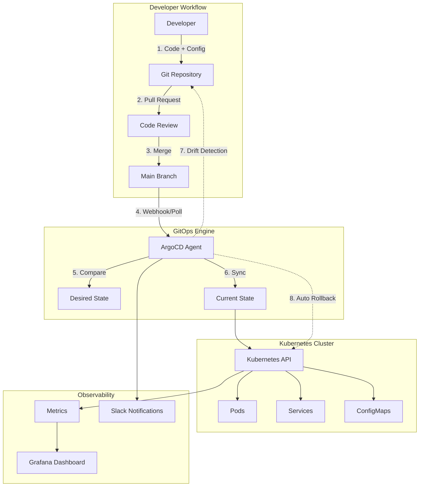
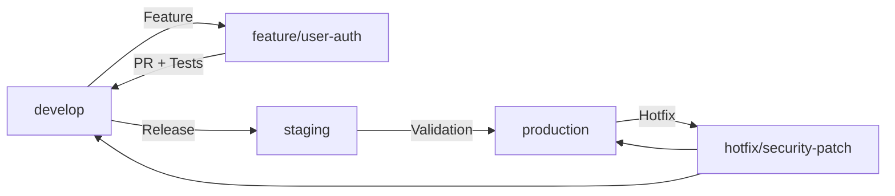

# 🔄 GitOps: Declarative Operations through Git

## 🎯 Introducción

**GitOps** es una metodología DevOps que utiliza Git como la **única fuente de verdad** para la infraestructura y aplicaciones declarativas. En lugar de ejecutar comandos imperativos, todo se gestiona a través de commits en Git.

### 🌟 **Principios Fundamentales**

1. **Declarativo**: Todo el sistema se describe declarativamente
2. **Versionado**: Estado del sistema versionado en Git  
3. **Automático**: Deployments automáticos desde Git
4. **Reconciliación**: Agentes aseguran estado deseado vs actual

---

## 🏗️ Arquitectura GitOps con Kubernetes



---

## 🚀 Implementación Práctica con ArgoCD

### **1. Instalación de ArgoCD**

```bash
# Crear namespace
kubectl create namespace argocd

# Instalar ArgoCD
kubectl apply -n argocd -f https://raw.githubusercontent.com/argoproj/argo-cd/stable/manifests/install.yaml

# Esperar a que esté listo
kubectl wait --for=condition=available --timeout=600s deployment/argocd-server -n argocd

# Obtener password inicial
kubectl -n argocd get secret argocd-initial-admin-secret -o jsonpath="{.data.password}" | base64 -d

# Port forward para acceso local
kubectl port-forward svc/argocd-server -n argocd 8080:443
```

### **2. Configuración de Repositorio GitOps**

```yaml
# argocd-repo-config.yaml
apiVersion: v1
kind: Secret
metadata:
  name: gitops-repo-secret
  namespace: argocd
  labels:
    argocd.argoproj.io/secret-type: repository
type: Opaque
stringData:
  type: git
  url: https://github.com/company/k8s-gitops
  password: github_pat_xxx
  username: gitops-user
---
# argocd-app-project.yaml
apiVersion: argoproj.io/v1alpha1
kind: AppProject
metadata:
  name: production
  namespace: argocd
spec:
  description: Production Applications Project
  sourceRepos:
  - 'https://github.com/company/k8s-gitops'
  - 'https://helm.nginx.com'
  - 'https://charts.bitnami.com/bitnami'
  destinations:
  - namespace: 'production'
    server: https://kubernetes.default.svc
  - namespace: 'staging'
    server: https://kubernetes.default.svc
  clusterResourceWhitelist:
  - group: ''
    kind: Namespace
  - group: 'rbac.authorization.k8s.io'
    kind: ClusterRole
  - group: 'rbac.authorization.k8s.io'
    kind: ClusterRoleBinding
  namespaceResourceBlacklist:
  - group: ''
    kind: ResourceQuota
  - group: ''
    kind: LimitRange
  roles:
  - name: production-admin
    description: Production admin role
    policies:
    - p, proj:production:production-admin, applications, *, production/*, allow
    - p, proj:production:production-admin, repositories, *, *, allow
    groups:
    - company:production-team
  - name: production-readonly
    description: Production readonly role
    policies:
    - p, proj:production:production-readonly, applications, get, production/*, allow
    - p, proj:production:production-readonly, applications, sync, production/*, deny
    groups:
    - company:developers
```

### **3. Aplicación GitOps - Ejemplo Completo**

```yaml
# applications/e-commerce-frontend.yaml
apiVersion: argoproj.io/v1alpha1
kind: Application
metadata:
  name: e-commerce-frontend
  namespace: argocd
  finalizers:
    - resources-finalizer.argocd.argoproj.io
spec:
  project: production
  source:
    repoURL: https://github.com/company/k8s-gitops
    targetRevision: main
    path: apps/e-commerce/frontend
    helm:
      valueFiles:
      - values.yaml
      - values-production.yaml
      parameters:
      - name: image.tag
        value: "v2.1.3"
      - name: replicas
        value: "10"
  destination:
    server: https://kubernetes.default.svc
    namespace: production
  syncPolicy:
    automated:
      prune: true      # Remove resources not in Git
      selfHeal: true   # Auto-sync when drift detected
      allowEmpty: false
    syncOptions:
    - CreateNamespace=true
    - PrunePropagationPolicy=foreground
    - PruneLast=true
    retry:
      limit: 5
      backoff:
        duration: 5s
        factor: 2
        maxDuration: 3m
  revisionHistoryLimit: 10
  # Health check customizations
  ignoreDifferences:
  - group: apps
    kind: Deployment
    jsonPointers:
    - /spec/replicas  # Ignore HPA changes
  - group: ""
    kind: Secret
    jsonPointers:
    - /data
---
# Application Set para múltiples entornos
apiVersion: argoproj.io/v1alpha1
kind: ApplicationSet
metadata:
  name: e-commerce-microservices
  namespace: argocd
spec:
  generators:
  - clusters:
      selector:
        matchLabels:
          environment: production
  - git:
      repoURL: https://github.com/company/k8s-gitops
      revision: HEAD
      directories:
      - path: apps/e-commerce/*
  template:
    metadata:
      name: '{{path.basename}}-{{cluster.name}}'
    spec:
      project: production
      source:
        repoURL: https://github.com/company/k8s-gitops
        targetRevision: HEAD
        path: '{{path}}'
        helm:
          valueFiles:
          - values.yaml
          - 'values-{{cluster.metadata.labels.environment}}.yaml'
      destination:
        server: '{{cluster.server}}'
        namespace: 'e-commerce-{{path.basename}}'
      syncPolicy:
        automated:
          prune: true
          selfHeal: true
        syncOptions:
        - CreateNamespace=true
```

---

## 🎯 Casos de Uso Reales

### **1. Weaveworks - Pioneros de GitOps**

```yaml
# weaveworks-pipeline.yaml
apiVersion: argoproj.io/v1alpha1
kind: Application
metadata:
  name: weaveworks-flux-demo
  namespace: argocd
spec:
  project: default
  source:
    repoURL: https://github.com/weaveworks/flux2-kustomize-helm-example
    targetRevision: main
    path: clusters/production
  destination:
    server: https://kubernetes.default.svc
    namespace: flux-system
  syncPolicy:
    automated:
      prune: true
      selfHeal: true
    syncOptions:
    - CreateNamespace=true
```

**Resultados Weaveworks**:
- **Deployment Frequency**: De semanas a múltiples por día
- **Lead Time**: 90% reducción (4 horas → 24 minutos)
- **MTTR**: 80% reducción (2 horas → 24 minutos)
- **Change Failure Rate**: 5% (vs 15% industry average)

### **2. Intuit - Enterprise GitOps**

```yaml
# intuit-multi-cluster.yaml
apiVersion: argoproj.io/v1alpha1
kind: ApplicationSet
metadata:
  name: intuit-tax-services
  namespace: argocd
spec:
  generators:
  - clusters:
      selector:
        matchLabels:
          company: intuit
          service: tax-preparation
  - matrix:
      generators:
      - clusters: {}
      - git:
          repoURL: https://github.com/intuit/gitops-tax-services
          revision: HEAD
          directories:
          - path: services/*
  template:
    metadata:
      name: '{{path.basename}}-{{cluster.name}}'
      annotations:
        intuit.com/team: "tax-platform"
        intuit.com/compliance: "sox-compliant"
    spec:
      project: tax-services
      source:
        repoURL: https://github.com/intuit/gitops-tax-services
        targetRevision: HEAD
        path: '{{path}}'
        helm:
          valueFiles:
          - values.yaml
          - 'values-{{cluster.metadata.labels.environment}}.yaml'
          parameters:
          - name: cluster.name
            value: '{{cluster.name}}'
          - name: cluster.region
            value: '{{cluster.metadata.labels.region}}'
      destination:
        server: '{{cluster.server}}'
        namespace: 'tax-{{path.basename}}'
      syncPolicy:
        automated:
          prune: true
          selfHeal: true
        syncOptions:
        - CreateNamespace=true
        - RespectIgnoreDifferences=true
```

**Resultados Intuit**:
- **50+ clusters** gestionados con GitOps
- **Zero-downtime deployments** durante tax season
- **SOX compliance** automática a través de Git audit
- **Developer satisfaction**: 4.2/5 → 4.8/5

---

## 🛡️ Seguridad y Compliance

### **Policy as Code con OPA Gatekeeper**

```yaml
# security-policies.yaml
apiVersion: templates.gatekeeper.sh/v1beta1
kind: ConstraintTemplate
metadata:
  name: k8srequiredlabels
spec:
  crd:
    spec:
      names:
        kind: K8sRequiredLabels
      validation:
        type: object
        properties:
          labels:
            type: array
            items:
              type: string
  targets:
    - target: admission.k8s.gatekeeper.sh
      rego: |
        package k8srequiredlabels
        
        violation[{"msg": msg}] {
          required := input.parameters.labels
          provided := input.review.object.metadata.labels
          missing := required[_]
          not provided[missing]
          msg := sprintf("Missing required label: %v", [missing])
        }
---
apiVersion: constraints.gatekeeper.sh/v1beta1
kind: K8sRequiredLabels
metadata:
  name: gitops-required-labels
spec:
  match:
    kinds:
      - apiGroups: ["apps"]
        kinds: ["Deployment"]
      - apiGroups: [""]
        kinds: ["Service"]
  parameters:
    labels: 
    - "app.kubernetes.io/name"
    - "app.kubernetes.io/version"
    - "app.kubernetes.io/managed-by"
    - "gitops.company.com/source-repo"
---
# Secret management con External Secrets
apiVersion: external-secrets.io/v1beta1
kind: SecretStore
metadata:
  name: vault-backend
  namespace: production
spec:
  provider:
    vault:
      server: "https://vault.company.com"
      path: "secret"
      version: "v2"
      auth:
        kubernetes:
          mountPath: "kubernetes"
          role: "production-secrets"
          serviceAccountRef:
            name: "external-secrets"
---
apiVersion: external-secrets.io/v1beta1
kind: ExternalSecret
metadata:
  name: database-credentials
  namespace: production
spec:
  refreshInterval: 15s
  secretStoreRef:
    name: vault-backend
    kind: SecretStore
  target:
    name: database-secret
    creationPolicy: Owner
  data:
  - secretKey: username
    remoteRef:
      key: database/production
      property: username
  - secretKey: password
    remoteRef:
      key: database/production
      property: password
```

---

## 📊 Monitoring y Observabilidad

### **ArgoCD Metrics con Prometheus**

```yaml
# argocd-monitoring.yaml
apiVersion: v1
kind: ServiceMonitor
metadata:
  name: argocd-metrics
  namespace: argocd
spec:
  selector:
    matchLabels:
      app.kubernetes.io/name: argocd-metrics
  endpoints:
  - port: metrics
    interval: 30s
    path: /metrics
---
apiVersion: v1
kind: ServiceMonitor
metadata:
  name: argocd-server-metrics
  namespace: argocd
spec:
  selector:
    matchLabels:
      app.kubernetes.io/name: argocd-server-metrics
  endpoints:
  - port: metrics
    interval: 30s
    path: /metrics
---
# Alerting rules
apiVersion: monitoring.coreos.com/v1
kind: PrometheusRule
metadata:
  name: argocd-alerts
  namespace: argocd
spec:
  groups:
  - name: argocd
    rules:
    - alert: ArgoCDAppSyncFailure
      expr: argocd_app_sync_total{phase="Failed"} > 0
      for: 5m
      labels:
        severity: warning
      annotations:
        summary: "ArgoCD application sync failed"
        description: "Application {{ $labels.name }} failed to sync for 5+ minutes"
    
    - alert: ArgoCDAppHealthDegraded
      expr: argocd_app_health_status{health_status!="Healthy"} > 0
      for: 10m
      labels:
        severity: critical
      annotations:
        summary: "ArgoCD application health degraded"
        description: "Application {{ $labels.name }} health is {{ $labels.health_status }}"
    
    - alert: ArgoCDDriftDetected
      expr: argocd_app_sync_status{sync_status="OutOfSync"} > 0
      for: 15m
      labels:
        severity: warning
      annotations:
        summary: "Configuration drift detected"
        description: "Application {{ $labels.name }} is out of sync with Git"
```

### **Grafana Dashboard**

```json
{
  "dashboard": {
    "id": null,
    "title": "GitOps - ArgoCD Dashboard",
    "tags": ["gitops", "argocd", "devops"],
    "timezone": "browser",
    "panels": [
      {
        "title": "Application Sync Status",
        "type": "stat",
        "targets": [
          {
            "expr": "sum(argocd_app_info{sync_status=\"Synced\"})",
            "legendFormat": "Synced"
          },
          {
            "expr": "sum(argocd_app_info{sync_status=\"OutOfSync\"})",
            "legendFormat": "Out of Sync"
          }
        ],
        "fieldConfig": {
          "defaults": {
            "color": {
              "mode": "thresholds"
            },
            "thresholds": {
              "steps": [
                {"color": "green", "value": null},
                {"color": "yellow", "value": 1},
                {"color": "red", "value": 5}
              ]
            }
          }
        }
      },
      {
        "title": "Deployment Frequency",
        "type": "graph",
        "targets": [
          {
            "expr": "increase(argocd_app_sync_total[1h])",
            "legendFormat": "Deployments per hour"
          }
        ]
      },
      {
        "title": "Sync Duration",
        "type": "graph",
        "targets": [
          {
            "expr": "histogram_quantile(0.95, sum(rate(argocd_app_reconcile_bucket[5m])) by (le))",
            "legendFormat": "95th percentile"
          },
          {
            "expr": "histogram_quantile(0.50, sum(rate(argocd_app_reconcile_bucket[5m])) by (le))",
            "legendFormat": "50th percentile"
          }
        ]
      }
    ]
  }
}
```

---

## 🎓 Mejores Prácticas

### **1. Estructura de Repositorio GitOps**

```
gitops-repo/
├── apps/
│   ├── production/
│   │   ├── frontend/
│   │   │   ├── deployment.yaml
│   │   │   ├── service.yaml
│   │   │   └── values-production.yaml
│   │   └── backend/
│   └── staging/
├── infrastructure/
│   ├── ingress/
│   ├── monitoring/
│   └── security/
├── clusters/
│   ├── production/
│   │   ├── kustomization.yaml
│   │   └── apps.yaml
│   └── staging/
└── policies/
    ├── security/
    └── compliance/
```

### **2. Commit Message Standards**

```bash
# Conventional Commits para GitOps
feat(frontend): add user authentication flow
fix(backend): resolve database connection timeout
docs(infrastructure): update monitoring setup
chore(deps): bump nginx version to 1.21.6

# Para rollbacks automáticos
revert: "feat(frontend): add user authentication flow"

# Para emergencias
hotfix(security): patch CVE-2023-1234 in base image
```

### **3. Branching Strategy**



---

## 🔧 Troubleshooting Común

### **Application Out of Sync**

```bash
# Ver diferencias
argocd app diff e-commerce-frontend

# Force sync
argocd app sync e-commerce-frontend --force

# Hard refresh
argocd app sync e-commerce-frontend --replace

# Ver logs del controller
kubectl logs -n argocd deployment/argocd-application-controller
```

### **Repository Connection Issues**

```bash
# Test repository connection
argocd repo list

# Add repository with token
argocd repo add https://github.com/company/gitops \
  --username gitops-user \
  --password github_pat_xxx

# Update repository credentials
kubectl patch secret gitops-repo-secret -n argocd \
  --type='json' \
  -p='[{"op": "replace", "path": "/data/password", "value": "bmV3X3Rva2VuX2hlcmU="}]'
```

---

## 📈 Métricas de Éxito GitOps

### **DORA Metrics con GitOps**

```yaml
# Custom metrics collector
apiVersion: v1
kind: ConfigMap
metadata:
  name: dora-metrics-config
  namespace: monitoring
data:
  config.yaml: |
    metrics:
      deployment_frequency:
        query: 'increase(argocd_app_sync_total{operation="sync"}[1d])'
        description: 'Deployments per day'
      
      lead_time:
        query: 'argocd_app_sync_total - argocd_app_sync_total offset 1h'
        description: 'Time from commit to deployment'
      
      change_failure_rate:
        query: 'argocd_app_sync_total{phase="Failed"} / argocd_app_sync_total'
        description: 'Percentage of failed deployments'
      
      recovery_time:
        query: 'argocd_app_health_status{health_status="Healthy"} - argocd_app_health_status{health_status="Degraded"}'
        description: 'Time to restore service'
```

**Benchmarks GitOps Elite Performers**:
- **Deployment Frequency**: Multiple per day
- **Lead Time**: < 1 hour (commit to production)
- **Change Failure Rate**: < 15%
- **Recovery Time**: < 1 hour

---

## 📚 Recursos y Referencias

### **Herramientas GitOps**
- **[ArgoCD](https://argo-cd.readthedocs.io/)** - Declarative GitOps for Kubernetes
- **[Flux](https://fluxcd.io/)** - GitOps operator for Kubernetes
- **[Jenkins X](https://jenkins-x.io/)** - GitOps for Jenkins
- **[Tekton](https://tekton.dev/)** - Cloud-native CI/CD

### **Documentación Oficial**
- [GitOps Principles - OpenGitOps](https://opengitops.dev/)
- [CNCF GitOps Working Group](https://github.com/cncf/tag-app-delivery/tree/main/gitops-wg)
- [ArgoCD Best Practices](https://argo-cd.readthedocs.io/en/stable/user-guide/best_practices/)

### **Casos de Estudio**
- [Weaveworks GitOps Case Studies](https://www.weave.works/case-studies/)
- [Intuit's Journey to GitOps](https://www.cncf.io/case-studies/intuit/)
- [Adobe's GitOps Implementation](https://blog.developer.adobe.com/gitops-at-adobe-a-journey-to-continuous-delivery-8a4b4c86dd27)

### **Certificaciones**
- **GitOps Fundamentals** - Linux Foundation
- **ArgoCD Certified User** - CNCF
- **Flux Fundamentals** - Weaveworks

---

*💡 GitOps no es solo una herramienta, es un cambio cultural hacia la transparencia total, auditabilidad completa y recuperación automática en tus deployments.* 