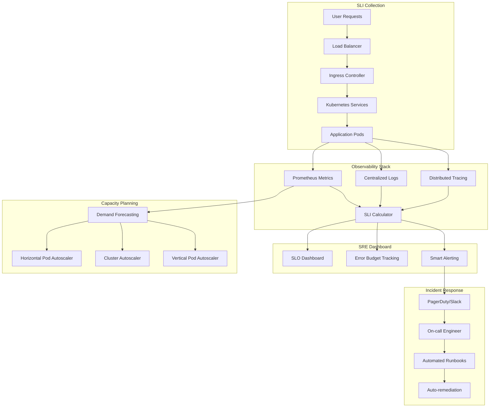

# 🎯 Site Reliability Engineering (SRE)

## 🎯 Introducción

**Site Reliability Engineering (SRE)** es la disciplina que aplica principios de ingeniería de software a problemas de infraestructura y operaciones. Desarrollada por Google, SRE busca crear sistemas escalables y altamente confiables.

### 🌟 **Principios Fundamentales SRE**

1. **Embrace Risk**: La confiabilidad perfecta es enemiga de la innovación
2. **Service Level Objectives**: Medir lo que importa a los usuarios
3. **Error Budgets**: Balance entre confiabilidad y velocidad
4. **Toil Automation**: Eliminar trabajo manual repetitivo
5. **Monitoring**: Observabilidad profunda del sistema
6. **Emergency Response**: Incident management estructurado
7. **Change Management**: Despliegues seguros y graduales
8. **Demand Forecasting**: Planificación de capacidad proactiva

---

## 🏗️ Arquitectura SRE con Kubernetes



---

## 📊 Service Level Indicators (SLIs) y Objectives (SLOs)

### **1. Definición de SLIs Críticos**

```yaml
# sli-config.yaml
apiVersion: v1
kind: ConfigMap
metadata:
  name: sli-config
  namespace: monitoring
data:
  sli-config.yaml: |
    slis:
      # Availability SLI
      availability:
        query: |
          (
            sum(rate(http_requests_total{job="api-server", code!~"5.."}[5m])) /
            sum(rate(http_requests_total{job="api-server"}[5m]))
          ) * 100
        unit: "percentage"
        description: "Percentage of successful HTTP requests"
      
      # Latency SLI
      latency_p99:
        query: |
          histogram_quantile(0.99,
            sum(rate(http_request_duration_seconds_bucket{job="api-server"}[5m])) by (le)
          ) * 1000
        unit: "milliseconds"
        description: "99th percentile of request latency"
      
      # Throughput SLI
      throughput:
        query: |
          sum(rate(http_requests_total{job="api-server"}[5m]))
        unit: "requests/second"
        description: "Request rate per second"
      
      # Error Rate SLI
      error_rate:
        query: |
          (
            sum(rate(http_requests_total{job="api-server", code=~"5.."}[5m])) /
            sum(rate(http_requests_total{job="api-server"}[5m]))
          ) * 100
        unit: "percentage"
        description: "Percentage of 5xx errors"
```

### **2. Service Level Objectives (SLOs)**

```yaml
# slo-definitions.yaml
apiVersion: sloth.slok.dev/v1
kind: PrometheusServiceLevel
metadata:
  name: e-commerce-api-slo
  namespace: monitoring
spec:
  service: "e-commerce-api"
  labels:
    team: "platform"
    tier: "critical"
  slos:
    # Availability SLO: 99.9% over 28 days
    - name: "availability"
      objective: 99.9
      description: "API availability SLO"
      sli:
        events:
          error_query: |
            sum(rate(http_requests_total{job="e-commerce-api", code=~"(5..|429)"}[5m]))
          total_query: |
            sum(rate(http_requests_total{job="e-commerce-api"}[5m]))
      alerting:
        name: ECommerceAPIAvailability
        labels:
          category: availability
        annotations:
          summary: "E-commerce API availability SLO violation"
        page_alert:
          labels:
            severity: critical
        ticket_alert:
          labels:
            severity: warning
    
    # Latency SLO: 95% of requests < 200ms
    - name: "latency"
      objective: 95.0
      description: "API latency SLO"
      sli:
        events:
          error_query: |
            sum(rate(http_request_duration_seconds_bucket{job="e-commerce-api", le="0.2"}[5m]))
          total_query: |
            sum(rate(http_request_duration_seconds_bucket{job="e-commerce-api", le="+Inf"}[5m]))
      alerting:
        name: ECommerceAPILatency
        labels:
          category: latency
---
# Error Budget Policy
apiVersion: v1
kind: ConfigMap
metadata:
  name: error-budget-policy
  namespace: monitoring
data:
  policy.yaml: |
    error_budget_policy:
      # When 100% of error budget is consumed
      critical_threshold: 1.0
      actions:
        - freeze_deployments
        - page_oncall_immediately
        - emergency_rollback_if_recent_change
      
      # When 75% of error budget is consumed  
      warning_threshold: 0.75
      actions:
        - slow_down_releases
        - increase_review_process
        - focus_on_reliability_features
      
      # When 50% of error budget is consumed
      notice_threshold: 0.5
      actions:
        - review_recent_changes
        - increase_monitoring
        - plan_reliability_improvements
```

---

## 🚨 Error Budget Management

### **Error Budget Calculator**

```yaml
# error-budget-calculator.yaml
apiVersion: apps/v1
kind: Deployment
metadata:
  name: error-budget-calculator
  namespace: monitoring
spec:
  replicas: 2
  selector:
    matchLabels:
      app: error-budget-calculator
  template:
    metadata:
      labels:
        app: error-budget-calculator
    spec:
      containers:
      - name: calculator
        image: sre/error-budget-calculator:v1.2.0
        ports:
        - containerPort: 8080
        env:
        - name: PROMETHEUS_URL
          value: "http://prometheus:9090"
        - name: SLO_CONFIG_PATH
          value: "/config/slo-config.yaml"
        - name: ALERT_WEBHOOK_URL
          valueFrom:
            secretKeyRef:
              name: alerting-secrets
              key: webhook-url
        volumeMounts:
        - name: config
          mountPath: /config
        resources:
          requests:
            memory: "128Mi"
            cpu: "100m"
          limits:
            memory: "256Mi"
            cpu: "200m"
        livenessProbe:
          httpGet:
            path: /health
            port: 8080
          initialDelaySeconds: 30
          periodSeconds: 10
        readinessProbe:
          httpGet:
            path: /ready
            port: 8080
          initialDelaySeconds: 5
          periodSeconds: 5
      volumes:
      - name: config
        configMap:
          name: slo-config
---
# Error Budget Alerting
apiVersion: monitoring.coreos.com/v1
kind: PrometheusRule
metadata:
  name: error-budget-alerts
  namespace: monitoring
spec:
  groups:
  - name: error-budget
    rules:
    - alert: ErrorBudgetCritical
      expr: |
        (
          1 - (
            sum(rate(http_requests_total{job="api-server", code!~"5.."}[28d])) /
            sum(rate(http_requests_total{job="api-server"}[28d]))
          )
        ) / (1 - 0.999) > 1.0
      for: 0m
      labels:
        severity: critical
        team: sre
      annotations:
        summary: "Error budget completely exhausted"
        description: "Service has exhausted its error budget. All deployments should be frozen."
        runbook_url: "https://runbooks.company.com/error-budget-exhausted"
    
    - alert: ErrorBudgetWarning
      expr: |
        (
          1 - (
            sum(rate(http_requests_total{job="api-server", code!~"5.."}[28d])) /
            sum(rate(http_requests_total{job="api-server"}[28d]))
          )
        ) / (1 - 0.999) > 0.75
      for: 5m
      labels:
        severity: warning
        team: sre
      annotations:
        summary: "Error budget 75% consumed"
        description: "Service has consumed 75% of its error budget. Consider slowing down releases."
```

---

## 🎯 Casos de Uso Reales

### **1. Google - Origenes del SRE**

```yaml
# google-style-slo.yaml
apiVersion: sloth.slok.dev/v1
kind: PrometheusServiceLevel
metadata:
  name: google-search-slo
  namespace: production
  annotations:
    sre.google.com/team: "search-reliability"
spec:
  service: "google-search"
  labels:
    product: "search"
    criticality: "critical"
  slos:
    # Google Search availability: 99.99%
    - name: "search-availability"
      objective: 99.99
      description: "Search service availability"
      sli:
        events:
          error_query: |
            sum(rate(search_requests_total{status=~"5.."}[5m]))
          total_query: |
            sum(rate(search_requests_total[5m]))
      alerting:
        name: GoogleSearchAvailability
        page_alert:
          labels:
            severity: critical
            oncall: "search-sre"
    
    # Search latency: 99% < 100ms
    - name: "search-latency"
      objective: 99.0
      description: "Search latency SLO"
      sli:
        events:
          error_query: |
            sum(rate(search_duration_seconds_bucket{le="0.1"}[5m]))
          total_query: |
            sum(rate(search_duration_seconds_bucket{le="+Inf"}[5m]))
```

**Resultados Google Search SRE**:
- **Uptime**: 99.999% (5.26 minutes downtime/year)
- **Latency**: 99% queries < 100ms
- **Error Budget**: 0.01% monthly (4.32 minutes)
- **Toil Reduction**: 90% automation vs manual work

### **2. Netflix - Chaos Engineering + SRE**

```yaml
# netflix-chaos-sre.yaml
apiVersion: apps/v1
kind: Deployment
metadata:
  name: netflix-chaos-sre
  namespace: chaos-engineering
spec:
  replicas: 1
  selector:
    matchLabels:
      app: chaos-sre
  template:
    metadata:
      labels:
        app: chaos-sre
    spec:
      containers:
      - name: chaos-controller
        image: netflix/chaos-controller:v2.1.0
        env:
        - name: SLO_PROMETHEUS_URL
          value: "http://prometheus:9090"
        - name: ERROR_BUDGET_THRESHOLD
          value: "0.5"  # Only run chaos if < 50% budget consumed
        - name: CHAOS_SCHEDULE
          value: "0 */4 * * 1-5"  # Every 4 hours, weekdays only
        command:
        - /bin/bash
        - -c
        - |
          while true; do
            # Check error budget before chaos
            ERROR_BUDGET=$(curl -s "$SLO_PROMETHEUS_URL/api/v1/query?query=error_budget_remaining" | jq '.data.result[0].value[1]' | tr -d '"')
            
            if (( $(echo "$ERROR_BUDGET > $ERROR_BUDGET_THRESHOLD" | bc -l) )); then
              echo "Error budget healthy ($ERROR_BUDGET), running chaos experiment"
              
              # Run Netflix Simian Army
              /opt/simian-army/chaos-monkey.sh \
                --target-service recommendation-service \
                --failure-type instance-termination \
                --blast-radius 1
              
              # Monitor SLO impact
              sleep 300  # Wait 5 minutes
              
              NEW_ERROR_BUDGET=$(curl -s "$SLO_PROMETHEUS_URL/api/v1/query?query=error_budget_remaining" | jq '.data.result[0].value[1]' | tr -d '"')
              
              if (( $(echo "$NEW_ERROR_BUDGET < 0.25" | bc -l) )); then
                echo "Chaos experiment consumed too much error budget, pausing"
                sleep 3600  # Wait 1 hour
              fi
            else
              echo "Error budget low ($ERROR_BUDGET), skipping chaos"
              sleep 1800  # Wait 30 minutes
            fi
            
            sleep 14400  # Wait 4 hours for next cycle
          done
        resources:
          requests:
            memory: "256Mi"
            cpu: "200m"
```

**Resultados Netflix SRE**:
- **Availability**: 99.99% durante peak traffic (200M+ users)
- **Chaos Testing**: 1000+ experiments mensuales sin SLO violation
- **Error Budget Usage**: Promedio 60% mensual, permitiendo innovación
- **MTTR**: < 5 minutos para la mayoría de incidentes

---

## 🤖 Automatización de Toil

### **Runbook Automation**

```yaml
# automated-runbook.yaml
apiVersion: tekton.dev/v1beta1
kind: Pipeline
metadata:
  name: incident-response-pipeline
  namespace: sre-automation
spec:
  params:
  - name: alert-name
    type: string
  - name: severity
    type: string
  - name: affected-service
    type: string
  
  tasks:
  - name: initial-assessment
    taskRef:
      name: assess-incident
    params:
    - name: service
      value: $(params.affected-service)
  
  - name: auto-mitigation
    taskRef:
      name: auto-mitigate
    runAfter: ["initial-assessment"]
    when:
    - input: $(params.severity)
      operator: in
      values: ["critical", "high"]
    params:
    - name: service
      value: $(params.affected-service)
    - name: mitigation-strategy
      value: $(tasks.initial-assessment.results.strategy)
  
  - name: notify-oncall
    taskRef:
      name: page-oncall
    runAfter: ["auto-mitigation"]
    params:
    - name: alert
      value: $(params.alert-name)
    - name: mitigation-attempted
      value: $(tasks.auto-mitigation.results.success)
---
apiVersion: tekton.dev/v1beta1
kind: Task
metadata:
  name: auto-mitigate
  namespace: sre-automation
spec:
  params:
  - name: service
    type: string
  - name: mitigation-strategy
    type: string
  
  results:
  - name: success
    description: Whether mitigation was successful
  
  steps:
  - name: execute-mitigation
    image: sre/auto-mitigate:v1.0.0
    script: |
      #!/bin/bash
      set -euo pipefail
      
      SERVICE="$(params.service)"
      STRATEGY="$(params.mitigation-strategy)"
      
      case $STRATEGY in
        "scale-up")
          echo "🔧 Scaling up $SERVICE"
          kubectl scale deployment $SERVICE --replicas=10
          
          # Wait for pods to be ready
          kubectl wait --for=condition=available deployment/$SERVICE --timeout=300s
          
          # Verify health
          if kubectl get deployment $SERVICE -o jsonpath='{.status.readyReplicas}' | grep -q "10"; then
            echo "✅ Scale-up successful"
            echo "true" > $(results.success.path)
          else
            echo "❌ Scale-up failed"
            echo "false" > $(results.success.path)
          fi
          ;;
          
        "rollback")
          echo "🔄 Rolling back $SERVICE"
          kubectl rollout undo deployment/$SERVICE
          
          # Wait for rollback
          kubectl rollout status deployment/$SERVICE --timeout=300s
          
          # Verify health
          if kubectl get deployment $SERVICE -o jsonpath='{.status.conditions[?(@.type=="Progressing")].status}' | grep -q "True"; then
            echo "✅ Rollback successful"
            echo "true" > $(results.success.path)
          else
            echo "❌ Rollback failed"
            echo "false" > $(results.success.path)
          fi
          ;;
          
        "circuit-breaker")
          echo "🚨 Enabling circuit breaker for $SERVICE"
          kubectl patch virtualservice $SERVICE --type='json' \
            -p='[{"op": "add", "path": "/spec/http/0/fault", "value": {"abort": {"percentage": {"value": 100}, "httpStatus": 503}}}]'
          
          echo "✅ Circuit breaker enabled"
          echo "true" > $(results.success.path)
          ;;
          
        *)
          echo "❓ Unknown mitigation strategy: $STRATEGY"
          echo "false" > $(results.success.path)
          ;;
      esac
```

### **Capacity Management Automation**

```yaml
# capacity-management.yaml
apiVersion: v1
kind: ConfigMap
metadata:
  name: capacity-forecast-config
  namespace: sre-automation
data:
  forecast.py: |
    import requests
    import numpy as np
    from sklearn.linear_model import LinearRegression
    import json
    import sys
    from datetime import datetime, timedelta
    
    def get_historical_metrics(prometheus_url, query, days=30):
        """Get historical metrics from Prometheus"""
        end_time = datetime.now()
        start_time = end_time - timedelta(days=days)
        
        params = {
            'query': query,
            'start': start_time.isoformat(),
            'end': end_time.isoformat(),
            'step': '1h'
        }
        
        response = requests.get(f"{prometheus_url}/api/v1/query_range", params=params)
        data = response.json()
        
        if data['status'] != 'success':
            raise Exception(f"Prometheus query failed: {data.get('error', 'Unknown error')}")
        
        return data['data']['result'][0]['values']
    
    def forecast_capacity(metrics_data, days_ahead=7):
        """Forecast capacity needs using linear regression"""
        # Convert to numpy arrays
        timestamps = np.array([float(point[0]) for point in metrics_data])
        values = np.array([float(point[1]) for point in metrics_data])
        
        # Reshape for sklearn
        X = timestamps.reshape(-1, 1)
        y = values
        
        # Train model
        model = LinearRegression()
        model.fit(X, y)
        
        # Forecast
        future_time = timestamps[-1] + (days_ahead * 24 * 3600)  # 7 days in seconds
        forecast = model.predict([[future_time]])
        
        return {
            'current_value': float(values[-1]),
            'forecasted_value': float(forecast[0]),
            'growth_rate': float((forecast[0] - values[-1]) / values[-1] * 100),
            'confidence': float(model.score(X, y))
        }
    
    def main():
        prometheus_url = sys.argv[1]
        service = sys.argv[2]
        
        # CPU usage forecast
        cpu_query = f'avg(cpu_usage_percent{{service="{service}"}})'
        cpu_data = get_historical_metrics(prometheus_url, cpu_query)
        cpu_forecast = forecast_capacity(cpu_data)
        
        # Memory usage forecast
        memory_query = f'avg(memory_usage_percent{{service="{service}"}})'
        memory_data = get_historical_metrics(prometheus_url, memory_query)
        memory_forecast = forecast_capacity(memory_data)
        
        # Request rate forecast
        request_query = f'sum(rate(http_requests_total{{service="{service}"}}[5m]))'
        request_data = get_historical_metrics(prometheus_url, request_query)
        request_forecast = forecast_capacity(request_data)
        
        # Generate recommendations
        recommendations = []
        
        if cpu_forecast['forecasted_value'] > 80:
            recommendations.append({
                'type': 'scale_up',
                'reason': f"CPU usage forecasted to reach {cpu_forecast['forecasted_value']:.1f}%",
                'action': 'Increase CPU limits or add more replicas'
            })
        
        if memory_forecast['forecasted_value'] > 85:
            recommendations.append({
                'type': 'scale_up',
                'reason': f"Memory usage forecasted to reach {memory_forecast['forecasted_value']:.1f}%",
                'action': 'Increase memory limits or add more replicas'
            })
        
        if request_forecast['growth_rate'] > 50:
            recommendations.append({
                'type': 'capacity_planning',
                'reason': f"Request rate growing at {request_forecast['growth_rate']:.1f}%",
                'action': 'Plan for additional infrastructure capacity'
            })
        
        # Output results
        result = {
            'service': service,
            'timestamp': datetime.now().isoformat(),
            'forecasts': {
                'cpu': cpu_forecast,
                'memory': memory_forecast,
                'requests': request_forecast
            },
            'recommendations': recommendations
        }
        
        print(json.dumps(result, indent=2))
    
    if __name__ == "__main__":
        main()
---
apiVersion: batch/v1
kind: CronJob
metadata:
  name: capacity-forecasting
  namespace: sre-automation
spec:
  schedule: "0 */6 * * *"  # Every 6 hours
  jobTemplate:
    spec:
      template:
        spec:
          containers:
          - name: forecaster
            image: python:3.9-slim
            command:
            - /bin/bash
            - -c
            - |
              pip install requests numpy scikit-learn
              python /scripts/forecast.py http://prometheus:9090 $SERVICE_NAME
            env:
            - name: SERVICE_NAME
              value: "e-commerce-api"
            volumeMounts:
            - name: scripts
              mountPath: /scripts
          volumes:
          - name: scripts
            configMap:
              name: capacity-forecast-config
          restartPolicy: OnFailure
```

---

## 📊 Dashboards SRE

### **Golden Signals Dashboard**

```json
{
  "dashboard": {
    "id": null,
    "title": "SRE Golden Signals Dashboard",
    "tags": ["sre", "golden-signals", "reliability"],
    "timezone": "browser",
    "refresh": "30s",
    "panels": [
      {
        "title": "Service Level Objectives (SLOs)",
        "type": "stat",
        "gridPos": {"h": 8, "w": 24, "x": 0, "y": 0},
        "targets": [
          {
            "expr": "slo_availability_ratio * 100",
            "legendFormat": "Availability SLO",
            "refId": "A"
          },
          {
            "expr": "slo_latency_ratio * 100", 
            "legendFormat": "Latency SLO",
            "refId": "B"
          }
        ],
        "fieldConfig": {
          "defaults": {
            "unit": "percent",
            "min": 95,
            "max": 100,
            "thresholds": {
              "steps": [
                {"color": "red", "value": 95},
                {"color": "yellow", "value": 99},
                {"color": "green", "value": 99.9}
              ]
            }
          }
        }
      },
      {
        "title": "Error Budget Burn Rate",
        "type": "graph",
        "gridPos": {"h": 8, "w": 12, "x": 0, "y": 8},
        "targets": [
          {
            "expr": "error_budget_burn_rate_1h",
            "legendFormat": "1h burn rate"
          },
          {
            "expr": "error_budget_burn_rate_6h",
            "legendFormat": "6h burn rate"  
          },
          {
            "expr": "error_budget_burn_rate_3d",
            "legendFormat": "3d burn rate"
          }
        ],
        "yAxes": [
          {
            "label": "Burn Rate",
            "min": 0
          }
        ],
        "alert": {
          "conditions": [
            {
              "query": {"params": ["A", "5m", "now"]},
              "reducer": {"params": [], "type": "last"},
              "evaluator": {"params": [2], "type": "gt"}
            }
          ],
          "executionErrorState": "alerting",
          "for": "5m",
          "frequency": "10s",
          "handler": 1,
          "name": "Error Budget Burn Rate Alert",
          "noDataState": "no_data"
        }
      },
      {
        "title": "Request Rate (Throughput)",
        "type": "graph", 
        "gridPos": {"h": 8, "w": 12, "x": 12, "y": 8},
        "targets": [
          {
            "expr": "sum(rate(http_requests_total[5m]))",
            "legendFormat": "Total RPS"
          },
          {
            "expr": "sum(rate(http_requests_total{code=~\"2..\"}[5m]))",
            "legendFormat": "Success RPS"
          },
          {
            "expr": "sum(rate(http_requests_total{code=~\"5..\"}[5m]))",
            "legendFormat": "Error RPS"
          }
        ]
      },
      {
        "title": "Response Time Distribution",
        "type": "heatmap",
        "gridPos": {"h": 8, "w": 24, "x": 0, "y": 16},
        "targets": [
          {
            "expr": "sum(rate(http_request_duration_seconds_bucket[5m])) by (le)",
            "legendFormat": "{{le}}"
          }
        ]
      }
    ]
  }
}
```

---

## 🎓 Mejores Prácticas SRE

### **1. SLO Setting Strategy**

```bash
# SLO Setting Framework

# 1. Identify User-Facing Services
kubectl get services --all-namespaces -l tier=frontend

# 2. Define Critical User Journeys
# - Login → Browse → Add to Cart → Checkout → Payment

# 3. Set Achievable SLOs (Start Conservative)
# - Availability: Start with 99.5%, target 99.9%
# - Latency: Start with P95 < 500ms, target P95 < 200ms
# - Throughput: Support peak + 20% buffer

# 4. Measure Current Performance
kubectl top pods --all-namespaces
kubectl get hpa --all-namespaces

# 5. Implement Error Budget Policy
# - 100% budget consumed = deployment freeze
# - 75% budget consumed = slow down releases  
# - 50% budget consumed = review reliability
```

### **2. Incident Response Maturity Model**

```yaml
# Level 0: Reactive (Manual)
incident_response_l0:
  detection: "User reports or monitoring alerts"
  response: "Manual investigation and remediation"
  communication: "Ad-hoc emails and calls"
  documentation: "Post-incident emails"

# Level 1: Structured (Documented)  
incident_response_l1:
  detection: "Comprehensive monitoring and alerting"
  response: "Documented runbooks and procedures"
  communication: "Incident chat rooms and status pages"
  documentation: "Structured post-mortems"

# Level 2: Automated (Partially)
incident_response_l2:
  detection: "Smart alerting with context"
  response: "Automated initial response + human escalation"
  communication: "Automated stakeholder notifications"
  documentation: "Templated post-mortems with metrics"

# Level 3: Self-Healing (Fully Automated)
incident_response_l3:
  detection: "Predictive anomaly detection"
  response: "Full auto-remediation for known issues"
  communication: "Proactive customer communication"
  documentation: "Automated root cause analysis"
```

---

## 📈 Métricas de Éxito SRE

### **SRE Team Performance**

```yaml
# SRE Team KPIs
sre_team_metrics:
  reliability:
    - slo_compliance_percentage: "> 99.5%"
    - mean_time_to_detection: "< 5 minutes"
    - mean_time_to_resolution: "< 30 minutes"
    - error_budget_utilization: "50-80%"
  
  toil_reduction:
    - manual_work_percentage: "< 50%"
    - automation_coverage: "> 80%"
    - runbook_automation_rate: "> 60%"
    - repeat_incident_rate: "< 10%"
  
  engineering_velocity:
    - feature_velocity_impact: "< 20% slowdown"
    - deployment_frequency: "> 1 per day"
    - lead_time_for_changes: "< 1 day"
    - change_failure_rate: "< 15%"
```

**Benchmarks Industry SRE Elite**:
- **Availability**: 99.99%+ (< 1 hour downtime/year)
- **MTTD**: < 5 minutes
- **MTTR**: < 30 minutes  
- **Toil**: < 50% of SRE time
- **Error Budget**: 60-80% monthly consumption

---

## 📚 Recursos y Referencias

### **Libros Fundamentales**
- **[Site Reliability Engineering](https://sre.google/sre-book/table-of-contents/)** - Google SRE Book
- **[The Site Reliability Workbook](https://sre.google/workbook/table-of-contents/)** - Google SRE Workbook  
- **[Seeking SRE](https://www.oreilly.com/library/view/seeking-sre/9781491978856/)** - Industry Perspectives

### **Herramientas SRE**
- **[Prometheus](https://prometheus.io/)** - Metrics collection and alerting
- **[Grafana](https://grafana.com/)** - Observability dashboards
- **[PagerDuty](https://www.pagerduty.com/)** - Incident response platform
- **[Sloth](https://github.com/slok/sloth)** - SLO generator for Prometheus
- **[Pyrra](https://github.com/pyrra-dev/pyrra)** - SLO monitoring

### **Certificaciones SRE**
- **Google Cloud Professional Cloud DevOps Engineer**
- **Linux Foundation SRE Fundamentals** 
- **DASA Site Reliability Engineering**

### **Casos de Estudio**
- [Google SRE Case Studies](https://sre.google/resources/practices-and-processes/)
- [Netflix SRE Practices](https://netflixtechblog.com/tagged/sre)
- [Spotify's SRE Journey](https://engineering.atspotify.com/category/site-reliability-engineering/)

---

*💡 SRE no es solo mantener sistemas funcionando, es encontrar el balance perfecto entre confiabilidad e innovación a través de ingeniería rigurosa y datos objetivos.* 