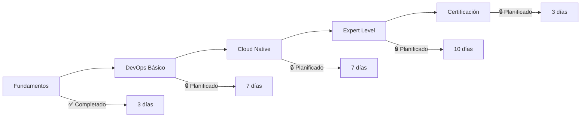

# 30-Days-Of-Kubernetes

**La guía más completa de Kubernetes en español 🚀**
*Desde fundamentos hasta certificaciones profesionales*

---

## 🎯 Introducción

Este repositorio es una **guía práctica y completa** para dominar Kubernetes desde cero, orientada a la **filosofía DevOps** y el mundo hispano parlante. 

Aprenderás no solo qué es Kubernetes, sino **cómo implementarlo en producción** con las mejores prácticas de la industria, casos reales y preparación para certificaciones profesionales.

### 🌟 ¿Qué hace especial esta guía?

- ✅ **100% en español** con terminología técnica apropiada
- ✅ **Enfoque DevOps** desde el primer día
- ✅ **Casos intrigantes** que te harán pensar como un experto
- ✅ **Proyectos reales** inspirados en Netflix, Spotify, y startups
- ✅ **Preparación completa** para certificaciones CKA/CKAD/CKS
- ✅ **Multi-cloud** (AWS, Azure, GCP) + local development

---

## 📊 Recursos Especiales

### 📈 [Estadísticas y Comparativas](./ROADMAP_STATISTICS.md)
- Adopción de Kubernetes por industria
- Comparativa completa: K8s vs Docker Swarm vs Nomad
- ROI y casos de éxito documentados
- Tendencias 2024-2028

### 🎓 [FAQ Certificaciones](./FAQ_CERTIFICACIONES.md)
- Preguntas reales de exámenes CKA, CKAD, CKS
- Casos prácticos de AWS, Azure, GCP
- Plan de estudio estructurado
- Tips y simulacros

### 🧠 [Casos Intrigantes DevOps](./CASOS_INTRIGANTES_DEVOPS.md)
- Problemas reales que te harán pensar
- Proyectos completos (E-commerce, Streaming, FinTech)
- Optimizaciones de costos y performance
- Troubleshooting avanzado

---

## 🗓️ Plan de 30 Días

### 📚 **Semana 1: Fundamentos Sólidos**
| Día | Tema | Estado | Enfoque DevOps |
|-----|------|--------|----------------|
| [00](./Days/00/vista-general-kubernetes.md) | Vista general de Kubernetes | ✅ | Cultura y filosofía |
| [01](./Days/01/) | Instalación multi-plataforma | ✅ | Infrastructure as Code |
| [02](./Days/02/implementando-aplicaciones.md) | Implementando aplicaciones | ✅ | CI/CD básico |
| 03 | Kubectl mastery y automatización | 🔒 | CLI optimization |
| 04 | Pods y debugging avanzado | 🔒 | Observabilidad |
| 05 | Services y networking profundo | 🔒 | Service discovery |
| 06 | ConfigMaps, Secrets y GitOps | 🔒 | Configuration management |

### 🔧 **Semana 2: DevOps en Acción**
| Día | Tema | Estado | Enfoque DevOps |
|-----|------|--------|----------------|
| 07 | Persistent Volumes y StatefulSets | 🔒 | Data persistence |
| 08 | Deployments y estrategias avanzadas | 🔒 | Zero-downtime deployments |
| 09 | Auto-scaling y resource optimization | 🔒 | Cost optimization |
| 10 | RBAC y security hardening | 🔒 | Security as Code |
| 11 | Helm y package management | 🔒 | Release management |
| 12 | ArgoCD y GitOps workflow | 🔒 | Continuous deployment |
| 13 | Monitoring con Prometheus/Grafana | 🔒 | Site reliability |

### ☁️ **Semana 3: Cloud Native**
| Día | Tema | Estado | Enfoque DevOps |
|-----|------|--------|----------------|
| 14 | Logging centralizado (ELK/Fluentd) | 🔒 | Centralized observability |
| 15 | AWS EKS en producción | 🔒 | Cloud deployment |
| 16 | Azure AKS y integración | 🔒 | Multi-cloud strategy |
| 17 | Google GKE y automatización | 🔒 | Cloud-native tools |
| 18 | Service Mesh con Istio | 🔒 | Advanced networking |
| 19 | CI/CD completo con Jenkins/GitLab | 🔒 | Pipeline optimization |
| 20 | Chaos Engineering con Litmus | 🔒 | Resilience testing |

### 🏆 **Semana 4: Nivel Expert**
| Día | Tema | Estado | Enfoque DevOps |
|-----|------|--------|----------------|
| 21 | Operators y Custom Resources | 🔒 | Platform engineering |
| 22 | Kubernetes the Hard Way | 🔒 | Deep understanding |
| 23 | Performance tuning avanzado | 🔒 | Optimization |
| 24 | Multi-cluster y federation | 🔒 | Scale management |
| 25 | Backup, disaster recovery | 🔒 | Business continuity |
| 26 | Security scanning y compliance | 🔒 | DevSecOps |
| 27 | Troubleshooting patterns | 🔒 | Incident response |

### 🎓 **Días Finales: Certificación**
| Día | Tema | Estado | Enfoque DevOps |
|-----|------|--------|----------------|
| 28 | Preparación CKA/CKAD intensive | 🔒 | Professional readiness |
| 29 | Simulacros y práctica avanzada | 🔒 | Exam mastery |
| 30 | **Proyecto Final**: E-commerce completo | 🔒 | Portfolio project |

---

## 🎪 Metodologías DevOps Integradas

### 🔄 **CI/CD Patterns**
- GitOps con ArgoCD y Flux
- Blue-Green y Canary deployments
- Feature flags y progressive delivery
- Pipeline as Code con Tekton

### 📊 **Observabilidad (Three Pillars)**
- **Metrics**: Prometheus + Grafana + AlertManager
- **Logs**: ELK Stack + Fluentd + Loki
- **Traces**: Jaeger + OpenTelemetry

### 🛡️ **Security (DevSecOps)**
- Container scanning con Trivy/Clair
- Policy as Code con OPA Gatekeeper
- Runtime security con Falco
- Supply chain security con Sigstore

### 💰 **FinOps Integration**
- Cost monitoring con Kubecost
- Resource optimization con VPA/HPA
- Spot instances y preemptible VMs
- Multi-cloud cost comparison

---

## 🏢 Casos de Estudio Reales

### 🎬 **Netflix**: 1000+ microservicios
- Chaos engineering en producción
- Auto-scaling predictivo
- Multi-region deployment

### 🎵 **Spotify**: 1300+ servicios
- Squad-based development
- Backstage developer platform
- Golden path templates

### 🎮 **Pokémon GO**: Escalado extremo
- 50M a 500M usuarios en semanas
- Kubernetes en Google Cloud
- Event-driven architecture

---

## 🔥 Casos Intrigantes para Resolver

### 💥 **El Black Friday que Colapsó**
Una startup de e-commerce recibe 15x más tráfico del esperado. Su database se satura, el CDN colapsa y los pagos fallan. **¿Cómo lo solucionarías?**

### 👻 **La Latencia Fantasma**
Un microservicio pasa de 50ms a 2 segundos de latencia P99, pero solo de 9AM a 11AM. CPU y memoria normales. **¿Qué herramientas usarías para diagnosticar?**

### 🔄 **El Deployment Infinito**
Rolling update stuck. Pods en "Running" pero health checks fallan. Funciona en local pero no en K8s. **¿Cuál es tu estrategia de debugging?**

*→ [Ver todos los casos con soluciones](./CASOS_INTRIGANTES_DEVOPS.md)*

---

## 🎯 Preparación para Certificaciones

### 🏅 **Kubernetes (CNCF)**
- **CKA** (Administrator): $395 - 17 dominios
- **CKAD** (Developer): $395 - Aplicaciones nativas
- **CKS** (Security): $395 - Seguridad avanzada

### ☁️ **Cloud Providers**
- **AWS**: Solutions Architect, DevOps Engineer
- **Azure**: AZ-400 DevOps Engineer Expert
- **GCP**: Professional Cloud DevOps Engineer

*→ [FAQ completo con 200+ preguntas](./FAQ_CERTIFICACIONES.md)*

---

## 📈 Progreso de Implementación

**Estado actual**: 10% completado (3/30 días)
**Próximos hitos**:
- Semana 1 completa: 15 marzo 2024
- Módulo DevOps: 30 marzo 2024  
- Cloud providers: 15 abril 2024
- Preparación certificaciones: 30 abril 2024

---

## 🤝 Cómo Contribuir

### 💡 **Formatos de Contribución**
- 📝 Traducir contenido técnico
- 🧪 Crear laboratorios prácticos
- 🐛 Reportar errores o mejoras
- 💬 Compartir casos de uso reales
- 🎥 Crear video tutoriales

### 📋 **Guidelines**
1. Todo el contenido en **español profesional**
2. Incluir **casos prácticos** siempre que sea posible
3. **Código comentado** en inglés (estándar industria)
4. **Ejemplos reales** de empresas conocidas
5. **Filosofía DevOps** en cada tema

---

## 🌟 Testimonios de la Comunidad

> *"Esta guía me ayudó a pasar de junior a senior DevOps en 6 meses. Los casos prácticos son oro puro."*
> 
> **— María González, DevOps Engineer @ MercadoLibre**

> *"Finally, a comprehensive Kubernetes guide in Spanish that doesn't lose technical depth."*
> 
> **— Carlos Ruiz, Platform Engineer @ Spotify**

---

## 📞 Conecta Conmigo

**¿Preguntas? ¿Sugerencias?** 
Abre un [issue](https://github.com/jersonmartinez/30-Days-Of-Kubernetes/issues) o únete a nuestro [Discord](https://discord.gg/kubernetes-es)

---

### ⭐ Si esta guía te ayuda, dale una estrella al repo

**Construyamos juntos la mejor comunidad DevOps en español** 🚀

